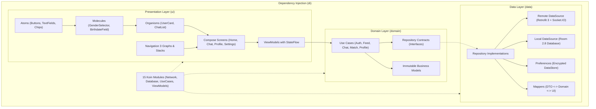

<p align="center">
  
</p>

<h1 align="center">MiraiLink</h1>

<p align="center">
  <strong>The social and dating platform designed for anime, manga, and gaming enthusiasts.</strong><br>
  <em>Connecting passions through Clean Architecture, Jetpack Compose, local Room database, and real-time communication.</em>
</p>

<p align="center">
  <a href="README.md">Español</a> · <b>English</b>
</p>

<p align="center">
  <a href="https://play.google.com/store/apps/details?id=com.feryaeljustice.mirailink" target="_blank">
    
  </a>
  
  
  
  
</p>

<p align="center">
  
  
  
  
  
</p>

- - -

## Table of Contents

- [Overview](#overview)
- [Visual Tour Gallery](#visual-tour-gallery)
- [Operating Modes: Online and Offline Demo](#operating-modes-online-and-offline-demo)
- [Core Features](#core-features)
- [Software Architecture](#software-architecture)
- [Tech Stack](#tech-stack)
- [Testing Strategy and Suite](#testing-strategy-and-suite)
- [Project Structure](#project-structure)
- [Requirements and Getting Started](#requirements-and-getting-started)
- [Best Practices and Security](#best-practices-and-security)
- [Contact and Credits](#contact-and-credits)

- - -

## Overview

**MiraiLink** is a flagship Android portfolio application designed to connect people passionate about anime, manga, JRPGs, visual novels, and gamer culture.

Built following modern engineering standards across the Android ecosystem:
- **Reactive and Declarative UI**: 100% Jetpack Compose Material 3 following the Atomic Design pattern (Atoms, Molecules, Organisms).
- **Google Navigation 3**: Decoupled navigation architecture with strongly-typed routes and serializable state backstacks.
- **Clean Architecture**: Strict separation of concerns (Data, Domain, UI layers) with reactive dependency injection using Koin.
- **Hybrid Operating Dual Mode**: Ability to switch between an online ExpressJS backend with WebSockets and a 100% offline Sandbox backed by Room 2.8 for instant exploration without requiring registration or internet connectivity.
- **Spec-Driven Mobile Development (SDMD)**: Built with an explicit safety harness preventing regressions, hallucinations, and unhandled mobile lifecycle states.

> **Available in Production**: You can test MiraiLink directly on your device by downloading it from the [Google Play Store](https://play.google.com/store/apps/details?id=com.feryaeljustice.mirailink).

- - -

## Visual Tour Gallery

All screenshots are taken from real user sessions in the application.

### Discovery and Matching

| 1. Welcome & Demo Mode | 2. Discovery Feed | 3. Messages and Matches | 4. Real-time Chat |
| :---: | :---: | :---: | :---: |
|  |  |  |  |
| Quick access via credentials or direct entry into **Offline Mode** with no sign up required. | Interactive profile cards with swipe animations, multiple photos, and interest-based affinity. | Top carousel for new connections and an organized inbox of active chat threads. | Bidirectional messaging with typed bubbles, delivery statuses, and emoji picker support. |

### Profile, Editing, and System Settings

| 5. User Profile | 6. Edit Form | 7. Settings & Management | 8. Clean Exit & Return |
| :---: | :---: | :---: | :---: |
|  |  |  |  |
| Display of biography, age, preferred genres, and catalog of favorite anime/games. | Reactive updates for personal details and tags reflected instantaneously across the UI. | Option to restore local Room sandbox data to factory state or exit demo mode. | Secure return to the authentication entry point ensuring complete session isolation. |

- - -

## Operating Modes: Online and Offline Demo

MiraiLink features a dynamic dependency inversion mechanism that allows switching between two operating modes without altering user experience:

```text
                      +-----------------------------+
                      |   MiraiLink Presentation    |
                      | (Compose Screens & ViewModels) |
                      +--------------+--------------+
                                     |
                                     v
                      +-----------------------------+
                      |       Domain UseCases       |
                      |   (Business Logic Contracts)|
                      +--------------+--------------+
                                     |
                +--------------------+--------------------+
                |                                         |
                v                                         v
   +-------------------------+               +-------------------------+
   |    Online Mode (API)    |               |   Offline Mode (Demo)   |
   | - ExpressJS Backend     |               | - Room Local Database   |
   | - Socket.IO real-time   |               | - Simulated Responses   |
   | - JWT in EncryptedStore |               | - Zero Sign up / Cloud  |
   | - FCM Notifications     |               | - Instant Reset Option  |
   +-------------------------+               +-------------------------+
```

### Mode Comparison

| Feature | Online Mode (Production) | Offline Demo Mode (Local Sandbox) |
| :--- | :--- | :--- |
| **Objective** | Connect real users through cloud services. | Instant evaluation of UX, navigation, and performance without registration barriers. |
| **Server Connection** | Required (REST API on `mirailink.xyz` and WebSockets). | None: works 100% locally and in airplane mode. |
| **Persistence** | Secure remote storage and JWT tokens in `EncryptedDataStore`. | Full local SQLite database managed with `Room 2.8.4`. |
| **Chat Behavior** | Real-time remote delivery via Socket.IO and polling. | Automated simulated responses triggered after 1 second to emulate real activity. |
| **Data Management** | Cloud sync and backups. | Settings button to **Reset demo data** back to initial factory values. |

- - -

## Core Features

- **Interest-Based Matching Algorithm**:
  - Discovery via smooth swipe gestures: right (Like) and left (Pass).
  - Compatibility matching based on favorite anime titles, manga genres, and video games.
  - Instant mutual match unlocking with celebration dialog.

- **Explore Hub & Thematic Feeds**:
  - Hybrid central hub inspired by Bumble (top horizontal recommendations carousel) and Tinder (two-column thematic grids).
  - Categorization across passion areas: Otaku & Anime (anime lovers, cosplay, ramen lovers, manga), Gaming (competitive duos, coop, casual), and Connections & Goals (friendship, dating, chatting).
  - Dedicated thematic swipe feeds with real-time aggregated profile counters cached for 5 minutes.
  - Isolated category discovery settings (10-500 km distance radius) via modal bottom sheet without altering global search preferences.

- **Real-Time Chat & Messaging**:
  - Bidirectional communication with WebSockets and continuous REST fallback.
  - Message history persistence organized by date and participant.
  - Integrated emoji picker and optimistic sending using unique UUIDs.

- **AI Smart Assistant**:
  - Generative AI integration (Gemini) in the `AiChatScreen` for contextual assistance, thematic recommendations, and conversational support.

- **High-Grade Security and Privacy**:
  - `EncryptedDataStore` backed by Android Keystore for secure access and refresh tokens.
  - Integration with the unified Android Credentials API.
  - Two-Factor Authentication (2FA) support via Time-based One-Time Passwords (TOTP).

- **Visual Design and Modern Platform Support**:
  - Full Edge-to-Edge display support on Android 15 and Android 16 (API 36 and 37).
  - Material 3 theme design with dynamic color schemes, dark mode support, and feature flags.

- - -

## Software Architecture

MiraiLink follows Clean Architecture principles to ensure decoupling, maintainability, and testability:



### Atomic Design in Compose

The presentation layer is structured following Atomic Design for reusability and compiler stability:
- **Atoms**: `MiraiLinkButton`, `MiraiLinkTextField`, `HashtagChip`, `MiraiLinkCheckbox`.
- **Molecules**: `GenderSelector`, `BirthdateField`, `ProfilePictureItem`, `SearchBar`.
- **Organisms**: `UserCard` (full swipe card), `ChatList`, `TopBarNavigation`, `BottomBarNavigation`.
- **Templates and Screens**: `HomeScreen`, `ChatScreen`, `ProfileScreen`, `AuthScreen`, `AiChatScreen`.

- - -

## Tech Stack

Centralized in the Gradle Version Catalog (`gradle/libs.versions.toml`):

| Category | Technology / Library | Version | Description / Usage |
| :--- | :--- | :--- | :--- |
| **Language** | Kotlin | `2.4.10` | Strict typing, coroutines, and reactive Flow |
| **Android Compiler** | Android Gradle Plugin (AGP) | `9.4.0` | Latest generation build tools |
| **SDK Targets** | Min SDK 26 / Compile & Target SDK 37 | Android 8.0 to 16 | Broad coverage and latest modern platform APIs |
| **UI Framework** | Jetpack Compose (Compose BOM) | `2026.08.00` | Declarative rendering with Material 3 |
| **Navigation** | Navigation 3 (Nav3 Core) | `1.1.7` | Google official decoupled navigation for Compose |
| **Dependency Injection** | Koin BOM & Annotations | `4.2.2` | Lightweight, modular, and testable DI without boilerplate |
| **Local Persistence** | Room Database | `2.8.4` | Typed SQLite with KSP for offline demo sandbox |
| **Encrypted Storage** | AndroidX Encrypted DataStore | `1.2.1` | Keystore-backed session token security |
| **Networking REST** | Retrofit 3 + OkHttp 5 | `3.0.0` / `5.5.0` | REST communication with auth interceptor and logging |
| **Real-time** | Socket.IO Client | `2.1.2` | WebSockets for instant message synchronization |
| **Serialization** | Kotlinx Serialization | `1.11.0` | High-performance JSON parsing in pure Kotlin |
| **Image Loading** | Coil Compose | `2.7.0` | Async image download, cache, and decoding |
| **Cloud & Analytics** | Firebase BOM | `34.18.0` | Crashlytics, Analytics, Remote Config, and Messaging |
| **Ads & Consent** | Google Mobile Ads & UMP | `25.4.0` / `4.0.0` | AdMob monetization with European GDPR consent |
| **Journey Testing** | Kotzilla | `2.3.5` | Automated E2E user journeys validation |
| **Screenshot Testing**| Android Screenshot Validation API | `0.0.1-alpha16` | Automated visual validation of Compose Previews |

- - -

## Testing Strategy and Suite

MiraiLink incorporates a comprehensive test pyramid to guarantee quality and avoid regressions:

```text
             / \
            /   \       Kotzilla Journeys (E2E User Flows)
           /-----\
          /       \     Screenshot Tests (Android Screenshot Validation API)
         /---------\
        /           \   Instrumented Tests (AndroidX Test, Espresso, UI Automator)
       /-------------\
      /               \ Unit Tests (JUnit 4, MockK, Turbine, Robolectric, Coroutines Test)
     -------------------
```

### Test Execution Commands

```powershell
# 1. Unit Tests (Use cases, ViewModels, mappers, repositories with KoinTest)
.\gradlew.bat testDebugUnitTest

# 2. Instrumented Tests (Run on connected device or emulator)
.\gradlew.bat connectedDebugAndroidTest

# 3. Screenshot Validation Tests (Compose Preview screenshot testing)
.\gradlew.bat validateDebugScreenshotTest

# 4. Update Reference Golden Screenshots
.\gradlew.bat updateDebugScreenshotTest

# 5. Static Analysis & Lint Checks
.\gradlew.bat lintDebug
```

> [!NOTE]
> **Windows Notice**: If running `validateDebugScreenshotTest` or `updateDebugScreenshotTest`, it is recommended to place the repository in a short file path to avoid Windows path length limitations (`MAX_PATH`).

- - -

## Project Structure

```text
MiraiLink/
├── app/
│   ├── src/
│   │   ├── main/
│   │   │   ├── java/com/feryaeljustice/mirailink/
│   │   │   │   ├── core/                  # Feature flags, remote configuration, constants
│   │   │   │   ├── data/                  # Data layer
│   │   │   │   │   ├── datasource/        # Remote data sources (Retrofit, Socket.IO) & local
│   │   │   │   │   ├── datastore/         # Credential encryption and DataStore preferences
│   │   │   │   │   ├── local/demo/        # Room Database, DAOs, and Offline Demo entities
│   │   │   │   │   ├── mappers/           # DTO <-> Domain <-> UI model mappers
│   │   │   │   │   ├── remote/            # API service interfaces and interceptors
│   │   │   │   │   └── repository/        # Repository implementations (online and demo)
│   │   │   │   ├── di/koin/               # 15 Koin dependency injection modules
│   │   │   │   ├── domain/                # Domain layer (pure business logic)
│   │   │   │   │   ├── model/             # Immutable business entities (User, Chat, Match)
│   │   │   │   │   ├── repository/        # Repository contracts and interfaces
│   │   │   │   │   └── usecase/           # Use cases (Auth, Chat, Feed, Match, Profile, AI)
│   │   │   │   └── ui/                    # Presentation layer (Jetpack Compose)
│   │   │   │       ├── components/        # Atomic Design components (Atoms, Molecules, Organisms)
│   │   │   │       ├── navigation/        # Navigation 3 routes and backstacks
│   │   │   │       ├── screens/           # Full screens with associated ViewModels
│   │   │   │       └── theme/             # Material 3 Theme, color palettes, typographies
│   │   │   └── res/                       # Native resources (vector icons, drawables, strings)
│   │   ├── test/                          # Local JVM unit tests with MockK and Turbine
│   │   ├── androidTest/                   # Instrumented on-device tests with KoinTest
│   │   ├── debug/screenshotTest/          # Reference golden screenshots for visual validation
│   │   └── journeysTest/                  # Automated journey tests with Kotzilla
│   └── build.gradle.kts                   # Module build configuration and dependencies
├── docs/                                  # Architecture, design, audit, and SDMD documentation
│   ├── generic_rules.md                   # Universal code quality rules
│   ├── mobile_guidelines.md               # Critical Mobile guidelines (SDMD)
│   ├── spec_template.md                   # Canonical functional specification template
│   ├── plan_template.md                   # Canonical technical architecture plan template
│   ├── PROMPTS.md                         # Canonical SDMD workflow prompts
│   ├── SDMD.md                            # Spec-Driven Mobile Development methodology guide
│   ├── features/                          # Spec-Anchor persistent features directory
│   └── screenshots/                       # High-resolution visual screenshots for README
├── gradle/
│   └── libs.versions.toml                 # Centralized Version Catalog
└── build.gradle.kts                       # Root project build script
```

- - -

## Requirements and Getting Started

### Prerequisites

- **JDK**: Java 17 or higher (Eclipse Temurin or OpenJDK 17+ recommended).
- **IDE**: Android Studio Ladybug, Koala, or higher (fully compatible with AGP 9.4).
- **Android SDK**: Build platform API 37 installed via SDK Manager.
- **Test Device**: Physical device or emulator running Android 8.0 (API 26) or higher with USB debugging enabled.

### Setup Instructions

1. **Clone the repository**:
   ```bash
   git clone https://github.com/FeryaelJustice/MiraiLink.git
   cd MiraiLink
   ```

2. **Sync dependencies**:
   Open the root folder in Android Studio and let Gradle automatically download dependencies using the included wrapper.

3. **Service Configuration Files (Optional for Offline Demo)**:
   - To build and test the app in its **Offline Demo Mode**, no external files are required.
   - To connect Firebase services in your own environment, place your `google-services.json` inside `app/`.
   - To sign release builds, configure your `keystore.properties` in the root project folder.

4. **Build and run from terminal**:

   **Windows (PowerShell):**
   ```powershell
   # Clean and assemble debug APK
   .\gradlew.bat clean assembleDebug

   # Install on connected device
   .\gradlew.bat installDebug

   # Launch app on device
   adb shell am start -n com.feryaeljustice.mirailink/.ui.MainActivity
   ```

   **macOS / Linux:**
   ```bash
   ./gradlew clean assembleDebug
   ./gradlew installDebug
   adb shell am start -n com.feryaeljustice.mirailink/.ui.MainActivity
   ```

- - -

## Best Practices and Security

- **Strict Dependency Inversion**: UI communicates solely with the Domain layer through UseCases and `StateFlow`, never accessing data sources or database tables directly.
- **Secure Secret Management**: Sensitive credentials, session tokens, and cryptographic keys are never logged in production builds.
- **Fault Resilience**: Typed error handling throughout the pipeline (`MiraiLinkResult`), providing user-friendly retry paths for network issues.
- **Adaptive Display**: Native support for display cutouts, gesture navigation, and system bars through `WindowInsetsCompat`.
- **Spec-Driven Mobile Development**: Structured feature planning with `spec.md`, `plan.md`, and `tasks.md` to prevent regressions and handle real-world mobile edge cases.

- - -

## Contact and Credits

Developed with dedication as a flagship Android software engineering portfolio application by **Feryael Justice**.

- **Google Play Store**: [Official MiraiLink Store Listing](https://play.google.com/store/apps/details?id=com.feryaeljustice.mirailink)
- **GitHub Profile**: [@FeryaelJustice](https://github.com/FeryaelJustice)
- **Bug Reports and Feedback**: Please use the [GitHub Issues](https://github.com/FeryaelJustice/MiraiLink/issues) section.

<p align="center">
  <sub>Built with passion for anime, video games, and world-class software engineering.</sub>
</p>
