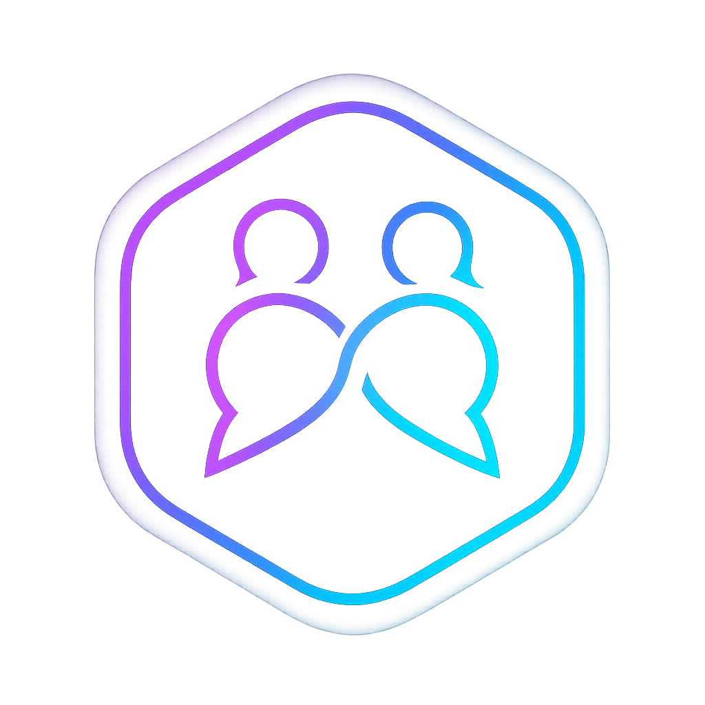
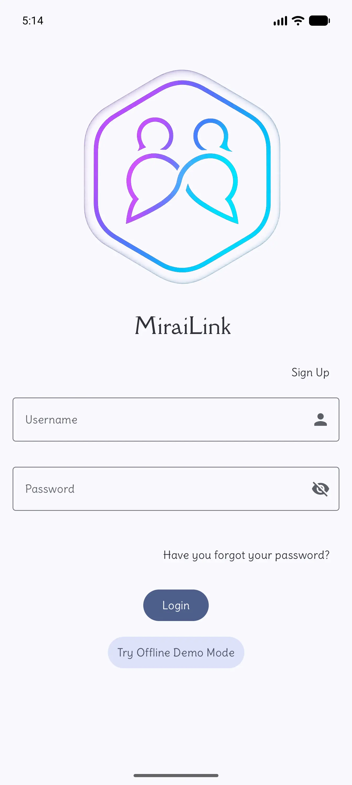
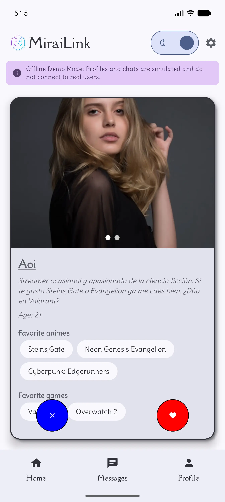
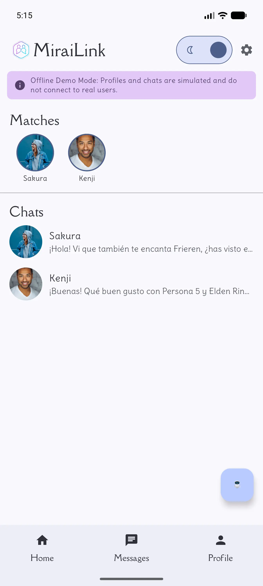
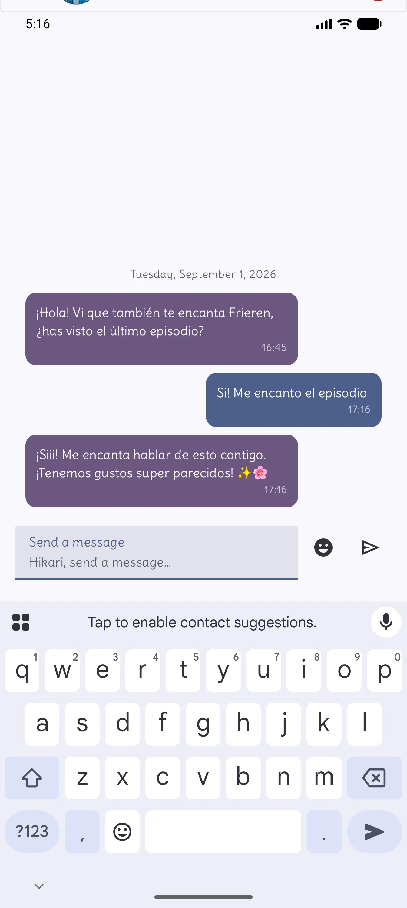
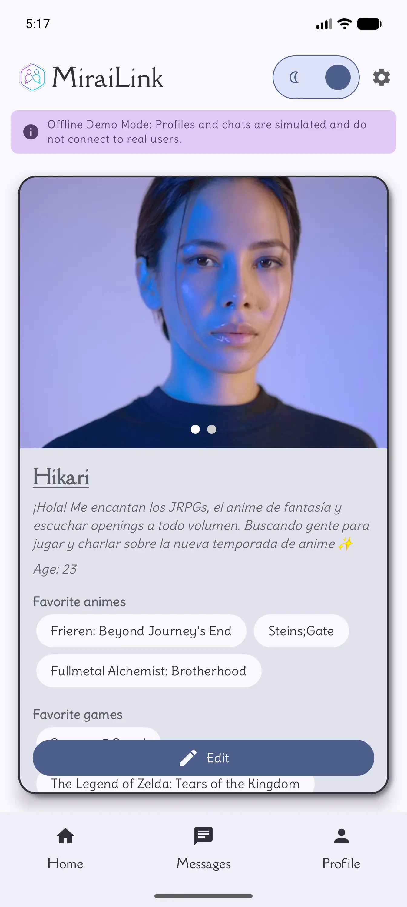
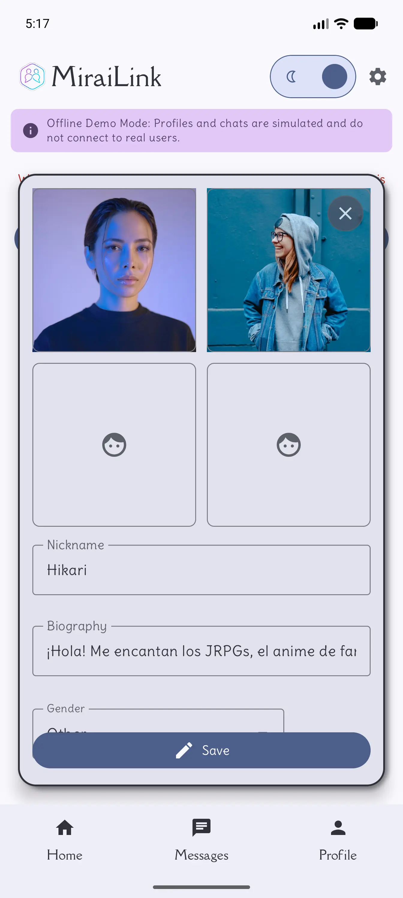
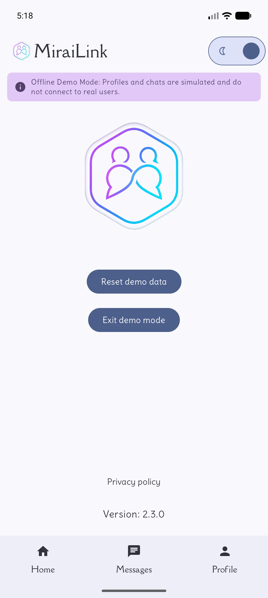
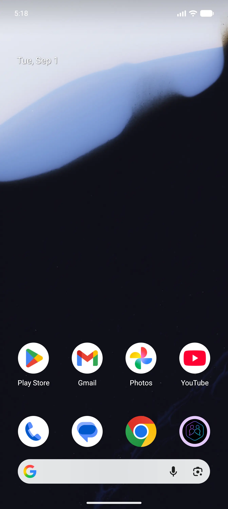
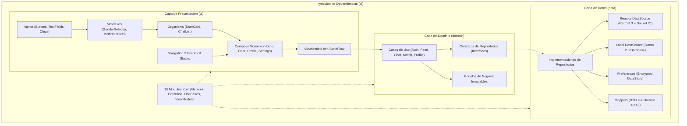

<p align="center">
  
</p>

<h1 align="center">MiraiLink</h1>

<p align="center">
  <strong>La plataforma social y de citas diseñada para entusiastas del anime, manga y videojuegos.</strong><br>
  <em>Conectando pasiones mediante Clean Architecture, Jetpack Compose, Room local y comunicacion en tiempo real.</em>
</p>

<p align="center">
  <a href="https://play.google.com/store/apps/details?id=com.feryaeljustice.mirailink" target="_blank">
    
  </a>
</p>

<p align="center">
  
  
  
  
  
  
  
  
  
</p>

- - -

## Indice

- [Vision General](#vision-general)
- [Galeria Visual del Recorrido](#galeria-visual-del-recorrido)
- [Modos de Operacion: Online y Offline Demo](#modos-de-operacion-online-y-offline-demo)
- [Funcionalidades Principales](#funcionalidades-principales)
- [Arquitectura de Software](#arquitectura-de-software)
- [Stack Tecnologico](#stack-tecnologico)
- [Estrategia y Suite de Testing](#estrategia-y-suite-de-testing)
- [Estructura del Proyecto](#estructura-del-proyecto)
- [Requisitos y Puesta en Marcha](#requisitos-y-puesta-en-marcha)
- [Buenas Practicas y Seguridad](#buenas-practicas-y-seguridad)
- [Contacto y Creditos](#contacto-y-creditos)

- - -

## Vision General

**MiraiLink** es la aplicacion estrella de portafolio Android concebida para unir a personas apasionadas por el anime, manga, JRPGs, novelas visuales y la cultura gamer.

Construida con los estandares de ingenieria mas modernos del ecosistema Android:
- **UI Reactiva y Declarativa**: 100% Jetpack Compose Material 3 bajo el patron Atomic Design (Atoms, Molecules, Organisms).
- **Navigation 3 de Google**: Arquitectura de navegacion desacoplada con rutas fuertemente tipadas y estado serializable.
- **Arquitectura Limpia**: Separacion estricta en capas (Data, Domain, UI) con inyeccion de dependencias reactiva mediante Koin.
- **Doble Modo Hibrido**: Capacidad de alternar entre un backend ExpressJS online con WebSockets y un entorno Sandbox 100% offline respaldado por Room 2.8 para pruebas instantaneas sin necesidad de registro ni conexion a internet.

> **Disponible en Produccion**: Puedes probar MiraiLink directamente en tu dispositivo descargandola en [Google Play Store](https://play.google.com/store/apps/details?id=com.feryaeljustice.mirailink).

- - -

## Galeria Visual del Recorrido

Todas las capturas provienen de sesiones de la aplicacion en funcionamiento real.

### Descubrimiento y Matching

| 1. Acceso y Modo Demo | 2. Feed de Descubrimiento | 3. Mensajes y Matches | 4. Chat en Tiempo Real |
| :---: | :---: | :---: | :---: |
|  |  |  |  |
| Acceso rapido mediante credenciales o entrada directa al **Modo Offline** sin registro. | Tarjetas interactivas con animaciones de swipe, fotos multiples y afinidad por intereses. | Carrusel superior de nuevas conexiones y bandeja organizada de chats activos. | Mensajeria bidireccional con burbujas tipadas, estados de envio y soporte de emojis. |

### Perfil, Edicion y Ajustes del Sistema

| 5. Perfil de Usuario | 6. Formulario de Edicion | 7. Ajustes y Gestion | 8. Retorno a Bienvenida |
| :---: | :---: | :---: | :---: |
|  |  |  |  |
| Visualizacion de biografia, edad, generos preferidos y catalogo de animes/juegos. | Actualizacion reactiva de datos personales y tags reflejados instantaneamente. | Opcion para restaurar el sandbox local de Room a estado de fabrica o salir del modo. | Retorno seguro al punto de autenticacion garantizando aislamiento de sesion. |

- - -

## Modos de Operacion: Online y Offline Demo

MiraiLink cuenta con un sistema de inversion de dependencias dinamico que permite conmutar entre dos modos de trabajo sin alterar la experiencia de usuario:

```
                      +-----------------------------+
                      |   MiraiLink Presentation    |
                      | (Compose Screens & ViewModels) |
                      +--------------+--------------+
                                     |
                                     v
                      +-----------------------------+
                      |       Domain UseCases       |
                      |   (Business Logic Contracts)|
                      +--------------+--------------+
                                     |
                +--------------------+--------------------+
                |                                         |
                v                                         v
   +-------------------------+               +-------------------------+
   |    Modo Online (API)    |               |   Modo Offline (Demo)   |
   | - Backend ExpressJS     |               | - Base de Datos Room    |
   | - Socket.IO real-time   |               | - Respuestas Simuladas  |
   | - JWT en EncryptedStore |               | - Cero Registro / Nube  |
   | - Notificaciones FCM    |               | - Reseteo Instantaneo   |
   +-------------------------+               +-------------------------+
```

### Tabla Comparativa de Modos

| Caracteristica | Modo Online (Produccion) | Modo Demostracion Offline (Local Sandbox) |
| :--- | :--- | :--- |
| **Objetivo** | Conectar usuarios reales a traves del servicio en la nube. | Evaluacion instantanea de UX, navegacion y rendimiento sin barreras de entrada. |
| **Conexion a Servidor** | Obligatoria (REST API en `mirailink.xyz` y WebSockets). | Nula: funciona 100% de manera local y en modo avion. |
| **Persistencia** | Almacenamiento remoto seguro y tokens JWT en `EncryptedDataStore`. | Base de datos SQLite local completa administrada con `Room 2.8.4`. |
| **Comportamiento Chat** | Entrega remota en tiempo real mediante Socket.IO y polling inteligente. | Respuestas automaticas simuladas tras 1 segundo para emular actividad real. |
| **Gestion de Datos** | Sincronizacion en la nube con respaldo. | Boton en Ajustes para **Restablecer datos de demostracion** a valores de fabrica. |

- - -

## Funcionalidades Principales

- **Algoritmo de Matching por Intereses**:
  - Descubrimiento mediante gestos fluidos de swipe: derecha (Like) e izquierda (Pass).
  - Cruce de compatibilidad segun animes favoritos, generos de manga y videojuegos.
  - Notificacion y desbloqueo instantaneo de coincidencia mutua (Match).

- **Chat en Tiempo Real y Mensajeria**:
  - Comunicacion bidireccional instantanea con WebSockets y fallback REST continuo.
  - Persistencia del historial de conversacion estructurado por fecha y participante.
  - Selector integrado de emojis y envio optimista con identificadores unicos UUID.

- **Asistente Inteligente IA**:
  - Integracion con modelos generativos (Gemini) en la pantalla `AiChatScreen` para asistencia contextual, recomendaciones tematicas y soporte interactivo.

- **Seguridad y Privacidad de Primer Nivel**:
  - `EncryptedDataStore` respaldado por Android Keystore para tokens de acceso y refresco.
  - Compatibilidad con la API unificada de Android Credentials.
  - Soporte para autenticacion en dos pasos (2FA) con codigos temporales (TOTP).

- **Diseno Visual y Personalizacion**:
  - Soporte completo para Edge to Edge en Android 15 y Android 16 (API 36 y 37).
  - Diseno tematico Material 3 con paleta cuidada, modo oscuro y feature flags dinamicos.

- - -

## Arquitectura de Software

MiraiLink sigue los principios de Clean Architecture para garantizar desacoplamiento, mantenibilidad y alta testabilidad:



### Patron de Diseno Atomico en Compose

La capa de presentacion esta estructurada siguiendo Atomic Design para favorecer la reutilizacion y la estabilidad del compilador Compose:
- **Atoms**: `MiraiLinkButton`, `MiraiLinkTextField`, `HashtagChip`, `MiraiLinkCheckbox`.
- **Molecules**: `GenderSelector`, `BirthdateField`, `ProfilePictureItem`, `SearchBar`.
- **Organisms**: `UserCard` (tarjeta de swipe completa), `ChatList`, `TopBarNavigation`, `BottomBarNavigation`.
- **Templates y Screens**: `HomeScreen`, `ChatScreen`, `ProfileScreen`, `AuthScreen`, `AiChatScreen`.

- - -

## Stack Tecnologico

Centralizado rigurosamente mediante Gradle Version Catalog (`gradle/libs.versions.toml`):

| Categoria | Tecnologia / Libreria | Version | Descripcion / Uso |
| :--- | :--- | :--- | :--- |
| **Lenguaje** | Kotlin | `2.4.10` | Tipado estricto, corrutinas y Flow reactivo |
| **Compilador Android** | Android Gradle Plugin (AGP) | `9.4.0` | Herramientas de build de ultima generacion |
| **SDK Targets** | Min SDK 26 / Compile y Target SDK 37 | Android 8.0 a 16 | Cobertura amplia y adopcion de las APIs mas modernas |
| **UI Framework** | Jetpack Compose (Compose BOM) | `2026.08.00` | Renderizado declarativo con Material 3 |
| **Navegacion** | Navigation 3 (Nav3 Core) | `1.1.7` | La nueva arquitectura oficial de navegacion para Compose |
| **Inyeccion de Dependencias** | Koin BOM y Annotations | `4.2.2` | Inyeccion ligera, modular y testeable sin boilerplate |
| **Persistencia Local** | Room Database | `2.8.4` | SQLite tipado con KSP para el sandbox offline |
| **Almacenamiento Cifrado** | AndroidX Encrypted DataStore | `1.2.1` | Seguridad para tokens de sesion con Android Keystore |
| **Networking REST** | Retrofit 3 + OkHttp 5 | `3.0.0` / `5.5.0` | Comunicacion REST con interceptor de auth y logs |
| **Tiempo Real** | Socket.IO Client | `2.1.2` | WebSockets para sincronizacion instantanea de mensajes |
| **Serializacion** | Kotlinx Serialization | `1.11.0` | Parsing JSON de alto rendimiento con Kotlin puro |
| **Carga de Imagenes** | Coil Compose | `2.7.0` | Descarga, cache y decodificacion asincrona de fotos |
| **Cloud y Analitica** | Firebase BOM | `34.18.0` | Crashlytics, Analytics, Remote Config y Cloud Messaging |
| **Publicidad y Consentimiento**| Google Mobile Ads y UMP | `25.4.0` / `4.0.0` | Anuncios AdMob con gestion de privacidad europea |
| **Testing de Journeys** | Kotzilla | `2.3.5` | Validacion automatizada de recorridos de usuario E2E |
| **Screenshot Testing** | Android Screenshot Validation API | `0.0.1-alpha16` | Validacion visual automatizada de previews Compose |

- - -

## Estrategia y Suite de Testing

MiraiLink dispone de una piramide de pruebas integral para asegurar calidad y prevenir regresiones en cada entrega:

```
             / \
            /   \       Kotzilla Journeys (E2E y Flujos de Usuario)
           /-----\
          /       \     Screenshot Tests (Android Screenshot Validation API)
         /---------\
        /           \   Instrumented Tests (AndroidX Test, Espresso, UI Automator)
       /-------------\
      /               \ Unit Tests (JUnit 4, MockK, Turbine, Robolectric, Coroutines Test)
     -------------------
```

### Comandos de Ejecucion de Pruebas

```powershell
# 1. Pruebas Unitarias (Casos de uso, ViewModels, mappers, repositorios con KoinTest)
.\gradlew.bat testDebugUnitTest

# 2. Pruebas Instrumentadas (Ejecucion en dispositivo o emulador conectado)
.\gradlew.bat connectedDebugAndroidTest

# 3. Validacion de Capturas de Pantalla (Screenshot Testing de Compose Previews)
.\gradlew.bat validateDebugScreenshotTest

# 4. Actualizacion de Screenshots Doradas de Referencia
.\gradlew.bat updateDebugScreenshotTest

# 5. Analisis Estatico y Calidad de Codigo (Lint)
.\gradlew.bat lintDebug
```

> [!NOTE]
> **Aviso para entornos Windows**: Si ejecutas las tareas de `validateDebugScreenshotTest` o `updateDebugScreenshotTest`, se recomienda ubicar el proyecto en una ruta corta (o en la raiz del disco) para evitar que el sistema de archivos de Windows supere el limite de longitud de ruta (`MAX_PATH`).

- - -

## Estructura del Proyecto

```text
MiraiLink/
├── app/
│   ├── src/
│   │   ├── main/
│   │   │   ├── java/com/feryaeljustice/mirailink/
│   │   │   │   ├── core/                  # Feature flags, configuracion remota, constantes
│   │   │   │   ├── data/                  # Capa de datos
│   │   │   │   │   ├── datasource/        # Fuentes remotas (Retrofit, Socket.IO) y locales
│   │   │   │   │   ├── datastore/         # Cifrado de credenciales y DataStore de preferencias
│   │   │   │   │   ├── local/demo/        # Room Database, DAOs y entidades del Modo Offline
│   │   │   │   │   ├── mappers/           # Mapeadores de DTO a Dominio y a Modelos de UI
│   │   │   │   │   ├── remote/            # Interfaces de servicios API e interceptores
│   │   │   │   │   └── repository/        # Implementaciones de repositorios (online y demo)
│   │   │   │   ├── di/koin/               # 15 modulos de inyeccion de dependencias Koin
│   │   │   │   ├── domain/                # Capa de dominio (logica pura de negocio)
│   │   │   │   │   ├── model/             # Entidades inmutables (User, Chat, Match, Catalog)
│   │   │   │   │   ├── repository/        # Contratos e interfaces de repositorios
│   │   │   │   │   └── usecase/           # Casos de uso (Auth, Chat, Feed, Match, Profile, AI)
│   │   │   │   └── ui/                    # Capa de presentacion (Jetpack Compose)
│   │   │   │       ├── components/        # Componentes Atomic Design (Atoms, Molecules, Organisms)
│   │   │   │       ├── navigation/        # Rutas y grafos de Navigation 3
│   │   │   │       ├── screens/           # Pantallas completas con sus ViewModels asociados
│   │   │   │       └── theme/             # Material 3 Theme, paletas de colores y tipografias
│   │   │   └── res/                       # Recursos nativos (iconos vectoriales, drawables, strings)
│   │   ├── test/                          # Tests unitarios locales con MockK y Turbine
│   │   ├── androidTest/                   # Tests instrumentados en dispositivo con KoinTest
│   │   ├── debug/screenshotTest/          # Capturas doradas de referencia para Screenshot Testing
│   │   └── journeysTest/                  # Pruebas automatizadas de recorridos con Kotzilla
│   └── build.gradle.kts                   # Configuracion de compilacion y dependencias del modulo
├── docs/                                  # Documentacion de diseno, auditorias y capturas
│   └── screenshots/                       # Galeria de imagenes en alta resolucion para el README
├── gradle/
│   └── libs.versions.toml                 # Version Catalog centralizado
└── build.gradle.kts                       # Script raiz del proyecto
```

- - -

## Requisitos y Puesta en Marcha

### Prerrequisitos

- **JDK**: Java 17 o superior (Eclipse Temurin u OpenJDK 17+ recomendados).
- **IDE**: Android Studio Ladybug, Koala o superior (totalmente compatible con AGP 9.4).
- **Android SDK**: Plataformas de compilacion API 37 instaladas mediante el SDK Manager.
- **Dispositivo de Prueba**: Emulador o movil fisico con Android 8.0 (API 26) o superior con depuracion USB habilitada.

### Configuracion Paso a Paso

1. **Clonar el repositorio**:
   ```bash
   git clone https://github.com/FeryaelJustice/MiraiLink.git
   cd MiraiLink
   ```

2. **Sincronizar dependencias**:
   Abre la carpeta raiz en Android Studio y permite que Gradle descargue las dependencias automaticamente utilizando el wrapper incluido.

3. **Archivos de configuracion de servicios (Opcional para Modo Offline)**:
   - Para compilar y evaluar la aplicacion en su **Modo Demo Offline**, no se requiere ningun archivo adicional.
   - Si deseas conectar con los servicios de Firebase en tu propio entorno, coloca tu `google-services.json` en `app/`.
   - Para firmar releases, configura tu propio `keystore.properties` en la raiz del proyecto.

4. **Compilar y ejecutar desde terminal**:

   **Windows (PowerShell):**
   ```powershell
   # Limpiar y compilar APK debug
   .\gradlew.bat clean assembleDebug

   # Instalar en el dispositivo conectado
   .\gradlew.bat installDebug

   # Lanzar la aplicacion de inmediato en el dispositivo
   adb shell am start -n com.feryaeljustice.mirailink/.ui.MainActivity
   ```

   **macOS / Linux:**
   ```bash
   ./gradlew clean assembleDebug
   ./gradlew installDebug
   adb shell am start -n com.feryaeljustice.mirailink/.ui.MainActivity
   ```

- - -

## Buenas Practicas y Seguridad

- **Inversion de Dependencias Estricta**: La UI solo se comunica con la capa de Dominio mediante casos de uso (`UseCases`) y `StateFlow`, nunca accediendo a datasources ni tablas directamente.
- **Gestion Segura de Secretos**: Los identificadores criticos, tokens de sesion y claves criptograficas nunca se imprimen en logs de depuracion en builds de produccion.
- **Resiliencia ante Fallos**: Manejo de errores tipado en toda la cadena (`MiraiLinkResult`), proporcionando reintentos fluidos al usuario ante contingencias de red.
- **Diseno Adaptativo**: Soporte automatico para pantallas con recorte (display cutouts), gestos de navegacion y barras del sistema mediante `WindowInsetsCompat`.

- - -

## Contacto y Creditos

Desarrollado con dedicacion como aplicacion estrella de portafolio de ingenieria Android por **Feryael Justice**.

- **Google Play Store**: [Ficha Oficial de MiraiLink](https://play.google.com/store/apps/details?id=com.feryaeljustice.mirailink)
- **Perfil de GitHub**: [@FeryaelJustice](https://github.com/FeryaelJustice)
- **Reporte de Errores e Ideas**: Por favor, utiliza la seccion de [GitHub Issues](https://github.com/FeryaelJustice/MiraiLink/issues).

<p align="center">
  <sub>Construido con pasion por el anime, los videojuegos y la ingenieria de software de clase mundial.</sub>
</p>

