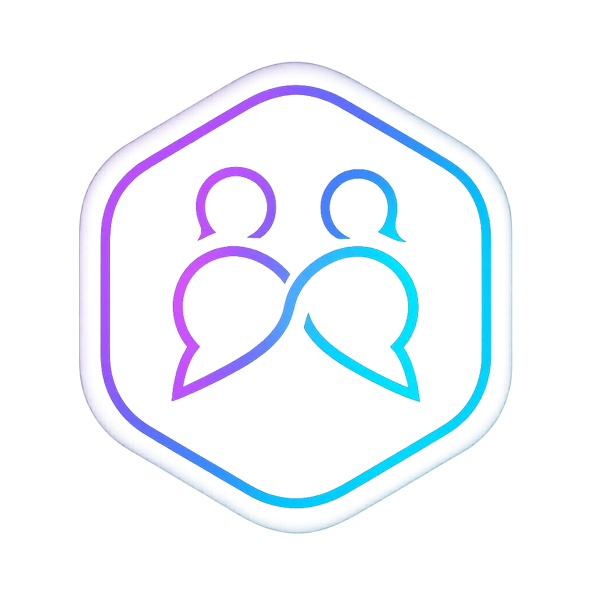
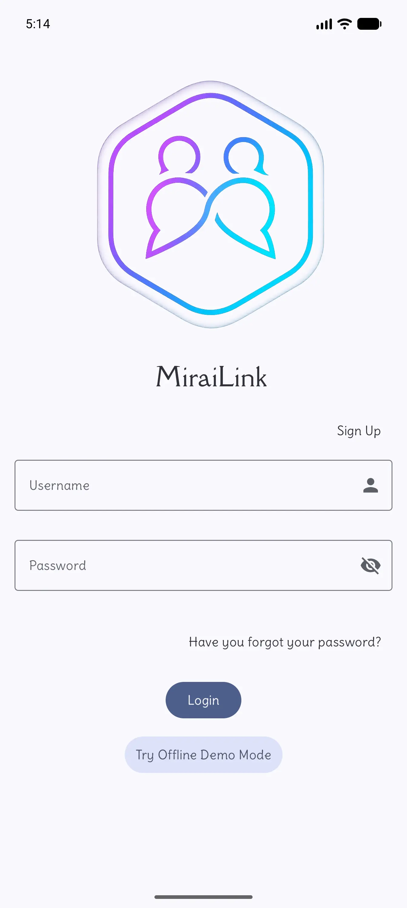
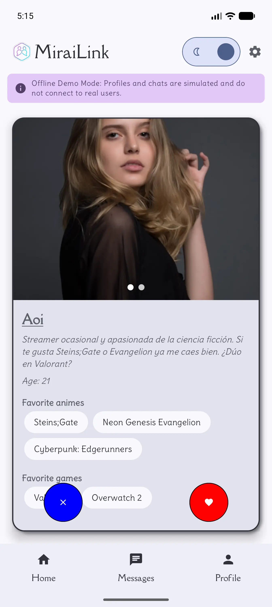
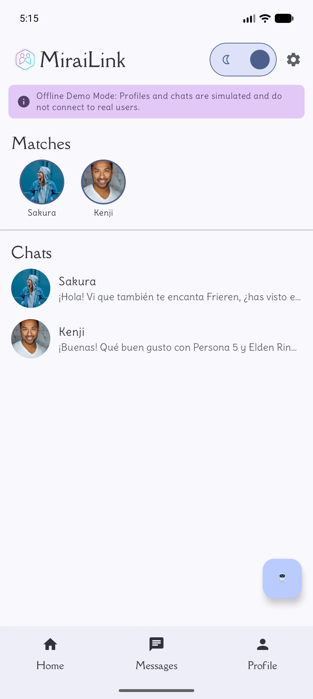
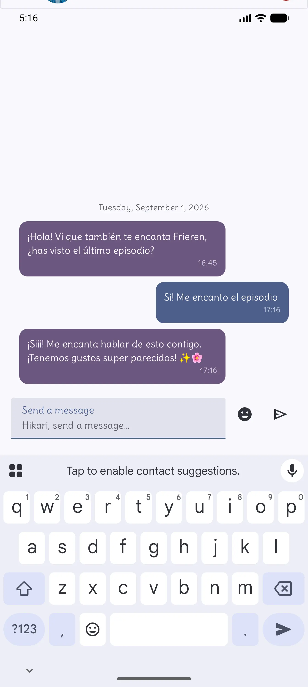
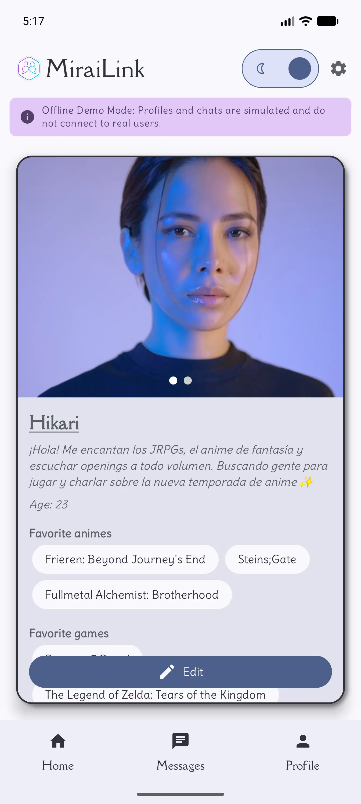
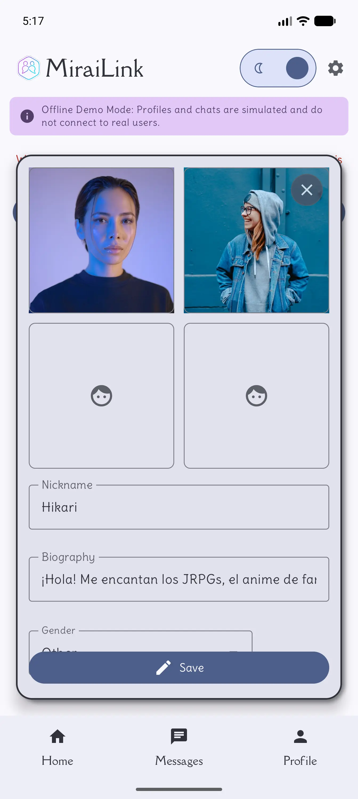
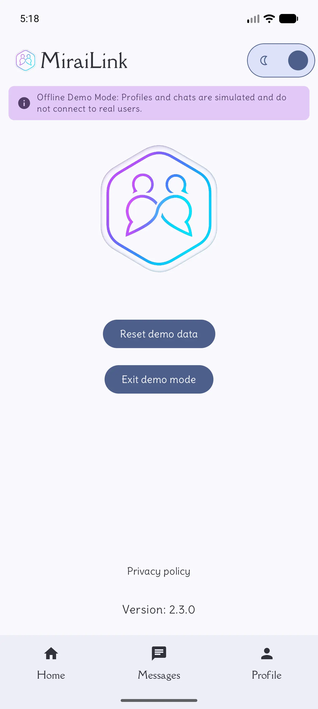
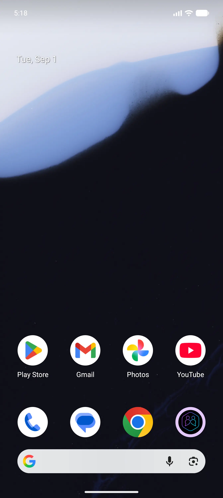
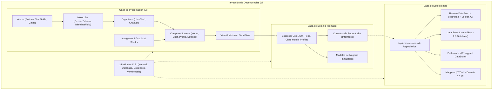

> **Estudio técnico del proyecto:** [Guía maestra en español](docs/guia-maestra.md), con documentos por tema, diagramas, configuración, casos de error y revisión conectada con el otro repositorio.

<p style="text-align: center;">
  
</p>

<h1 style="text-align: center;">MiraiLink</h1>

<p style="text-align: center;">
  <strong>La plataforma social y de citas diseñada para entusiastas del anime, manga y videojuegos.</strong><br>
  <em>Conectando pasiones mediante capas de arquitectura, Jetpack Compose, Room demo y comunicación REST.</em>
</p>

<p style="text-align: center;">
  <b>Español</b> · <a href="README.en.md">English</a>
</p>

<p style="text-align: center;">
  <a href="https://play.google.com/store/apps/details?id=com.feryaeljustice.mirailink" target="_blank">
    
  </a>
  
  
  
  
</p>

<p style="text-align: center;">
  
  
  
  
  
</p>

- - -

## Índice

- [Visión General](#visión-general)
- [Galería Visual del Recorrido](#galería-visual-del-recorrido)
- [Modos de Operación: Online y Offline Demo](#modos-de-operación-online-y-offline-demo)
- [Funcionalidades Principales](#funcionalidades-principales)
- [Arquitectura de Software](#arquitectura-de-software)
- [Stack Tecnológico](#stack-tecnológico)
- [Estrategia y Suite de Testing](#estrategia-y-suite-de-testing)
- [Estructura del Proyecto](#estructura-del-proyecto)
- [Requisitos y Puesta en Marcha](#requisitos-y-puesta-en-marcha)
- [Buenas Prácticas y Seguridad](#buenas-prácticas-y-seguridad)
- [Contacto y Créditos](#contacto-y-créditos)

- - -

## Visión General

**MiraiLink** es la aplicación estrella de portafolio Android concebida para unir a personas apasionadas por el anime, manga, JRPGs, novelas visuales y la cultura gamer.

Construida con los estándares de ingeniería más modernos del ecosistema Android:
- **UI Reactiva y Declarativa**: 100% Jetpack Compose Material 3 bajo el patrón Atomic Design (Atoms, Molecules, Organisms).
- **Navigation 3 de Google**: Arquitectura de navegación desacoplada con rutas fuertemente tipadas y estado serializable.
- **Arquitectura por capas**: Separación pragmática en paquetes (Data, Domain, UI) con inyección de dependencias reactiva mediante Koin.
- **Doble Modo Hibrido**: Capacidad de alternar entre un backend ExpressJS online por HTTP REST y un entorno Sandbox 100% offline respaldado por Room 2.8 para pruebas instantaneas sin necesidad de registro ni conexión a internet.

> **Disponible en Producción**: Puedes probar MiraiLink directamente en tu dispositivo descargándola en [Google Play Store](https://play.google.com/store/apps/details?id=com.feryaeljustice.mirailink).

- - -

## Galería Visual del Recorrido

Todas las capturas provienen de sesiones de la aplicación en funcionamiento real.

### Descubrimiento y Matching

| 1. Acceso y Modo Demo | 2. Feed de Descubrimiento | 3. Mensajes y Matches | 4. Chat por REST |
| :---: | :---: | :---: | :---: |
|  |  |  |  |
| Acceso rápido mediante credenciales o entrada directa al **Modo Offline** sin registro. | Tarjetas interactivas con animaciones de swipe, fotos múltiples y afinidad por intereses. | Carrusel superior de nuevas conexiones y bandeja organizada de chats activos. | Mensajería bidireccional con burbujas tipadas, estados de envío y soporte de emojis. |

### Perfil, Edición y Ajustes del Sistema

| 5. Perfil de Usuario | 6. Formulario de Edición | 7. Ajustes y Gestión | 8. Retorno a Bienvenida |
| :---: | :---: | :---: | :---: |
|  |  |  |  |
| Visualización de biografía, edad, generos preferidos y catálogo de animes/juegos. | Actualización reactiva de datos personales y tags reflejados instantáneamente. | Opción para restaurar el sandbox local de Room a estado de fábrica o salir del modo. | Retorno seguro al punto de autenticación garantizando aislamiento de sesión. |

- - -

## Modos de Operación: Online y Offline Demo

MiraiLink cuenta con un sistema de inversión de dependencias dinámico que permite conmutar entre dos modos de trabajo sin alterar la experiencia de usuario:

```
                      +-----------------------------+
                      |   MiraiLink Presentation    |
                      | (Compose Screens & ViewModels) |
                      +--------------+--------------+
                                     |
                                     v
                      +-----------------------------+
                      |       Domain UseCases       |
                      |   (Business Logic Contracts)|
                      +--------------+--------------+
                                     |
                +--------------------+--------------------+
                |                                         |
                v                                         v
   +-------------------------+               +-------------------------+
   |    Modo Online (API)    |               |   Modo Offline (Demo)   |
   | - Backend ExpressJS     |               | - Base de Datos Room    |
   | - REST polling de chat   |               | - Respuestas Simuladas  |
   | - JWT en EncryptedStore |               | - Cero Registro / Nube  |
   | - Notificaciones FCM    |               | - Reseteo Instantáneo   |
   +-------------------------+               +-------------------------+
```

### Tabla Comparativa de Modos

| Característica | Modo Online (Producción) | Modo Demostración Offline (Local Sandbox) |
| :--- | :--- | :--- |
| **Objetivo** | Conectar usuarios reales a través del servicio en la nube. | Evaluación instantánea de UX, navegación y rendimiento sin barreras de entrada. |
| **Conexión a Servidor** | Obligatoria (REST API en el origen configurado). | Nula: funciona 100% de manera local y en modo avión. |
| **Persistencia** | Almacenamiento remoto seguro y tokens JWT en `EncryptedDataStore`. | Base de datos SQLite local completa administrada con `Room 2.8.5`. |
| **Comportamiento Chat** | Historial y envío REST, con consulta periódica cada tres segundos. | Respuestas automáticas simuladas tras 1 segundo para emular actividad real. |
| **Gestión de Datos** | Sincronización en la nube con respaldo. | Botón en Ajustes para **Restablecer datos de demostración** a valores de fábrica. |

- - -

## Funcionalidades Principales

- **Perfil Holo-3D (Holo Mirai)**:
  - Profundidad sutil por inclinación en la foto visible de la tarjeta superior de Inicio y los feeds de Explorar, con reflejo de borde según el tema.
  - Segmentación local de retratos con ML Kit; alternativa de foto completa o estática cuando corresponde. Ajuste local en Apariencia, pausa durante interacción, ahorro de batería y animaciones deshabilitadas.
  - Conserva las acciones de swipe, carrusel, vista ampliada, deshacer y latido háptico. [Diseño y límites](docs/features/holo_mirai_parallax/implementation.md), [evidencia y comprobaciones pendientes](docs/features/holo_mirai_parallax/verification.md).

- **Algoritmo de Matching por Intereses**:
  - Descubrimiento mediante gestos fluidos de swipe: derecha (Like) e izquierda (Pass).
  - Cruce de compatibilidad según animes favoritos, generos de manga y videojuegos.
  - Notificación y desbloqueo instantáneo de coincidencia mutua (Match).

- **Sección Explorar (Explore Hub) y Feeds Temáticos**:
  - Hub central hibrido inspirado en Bumble (carrusel superior de recomendaciones destacadas) y Tinder (cuadrículas temáticas de dos columnas).
  - Agrupación por categorías de interés: Otaku & Anime (amantes del anime, cosplay, ramen lovers, manga), Videojuegos & Gaming (dúos competitivos, coop, casual) y Conexiones & Metas (amistad, citas, charlar).
  - Feeds temáticos dedicados con navegación completa de swipes y contadores reales agregados con caché de 5 minutos.
  - Ajustes de descubrimiento independientes por categoría (radio de distancia 10-500 km) mediante hoja modal que preserva las preferencias globales de búsqueda del usuario.

- **Chat por REST y Mensajería**:
  - Comunicación REST con consulta periódica de mensajes; SocketService es infraestructura registrada.
  - Persistencia del historial de conversación estructurado por fecha y participante.
  - Selector integrado de emojis y envío optimista con identificadores únicos UUID.

- **Asistente Inteligente IA**:
  - Integración con modelos generativos (Gemini) en la pantalla `AiChatScreen` para asistencia contextual, recomendaciones temáticas y soporte interactivo.

- **Seguridad y Privacidad de Primer Nivel**:
  - `EncryptedDataStore` respaldado por Android Keystore para tokens de acceso y refresco.
  - Compatibilidad con la API unificada de Android Credentials.
  - Soporte para autenticación en dos pasos (2FA) con códigos temporales (TOTP).

- **Diseño Visual y Personalización**:
  - Soporte completo para Edge to Edge en Android 15 y Android 16 (API 36 y 37).
  - Diseño temático Material 3 con paleta cuidada, modo oscuro y feature flags dinámicos.

- - -

## Arquitectura de Software

MiraiLink sigue los principios de Clean Architecture para garantizar desacoplamiento, mantenibilidad y alta testabilidad:


```mermaid
flowchart TD
    subgraph UI ["Capa de Presentación (ui)"]
        Screens["Compose Screens (Home, Chat, Profile, Settings)"]
        Atoms["Atoms (Buttons, TextFields, Chips)"]
        Molecules["Molecules (GenderSelector, BirthdateField)"]
        Organisms["Organisms (UserCard, ChatList)"]
        Nav["Navigation 3 Graphs & Stacks"]
        VM["ViewModels con StateFlow"]
        Screens --> VM
        Atoms --> Molecules --> Organisms --> Screens
        Nav --> Screens
    end

    subgraph Domain ["Capa de Dominio (domain)"]
        UC["Casos de Uso (Auth, Feed, Chat, Match, Profile)"]
        RepoInterfaces["Contratos de Repositorios (Interfaces)"]
        Entities["Modelos de Negocio Inmutables"]
        VM --> UC
        UC --> RepoInterfaces
        UC --> Entities
    end

    subgraph Data ["Capa de Datos (data)"]
        RepoImpl["Implementaciones de Repositorios"]
        RemoteDS["Remote DataSource (Retrofit 3 + Socket.IO)"]
        LocalDS["Local DataSource (Room 2.8 Database)"]
        StoreDS["Preferences (Encrypted DataStore)"]
        Mappers["Mappers (DTO <-> Domain <-> UI)"]
        RepoInterfaces -.-> RepoImpl
        RepoImpl --> RemoteDS
        RepoImpl --> LocalDS
        RepoImpl --> StoreDS
        RepoImpl --> Mappers
    end

    subgraph DI ["Inyección de Dependencias (di)"]
        KoinModules["15 Módulos Koin (Network, Database, UseCases, ViewModels)"]
        KoinModules -.-> UI
        KoinModules -.-> Domain
        KoinModules -.-> Data
    end
```

### Patrón de Diseño Atómico en Compose

La capa de presentación está estructurada siguiendo Atomic Design para favorecer la reutilización y la estabilidad del compilador Compose:
- **Atoms**: `MiraiLinkButton`, `MiraiLinkTextField`, `HashtagChip`, `MiraiLinkCheckbox`.
- **Molecules**: `GenderSelector`, `BirthdateField`, `ProfilePictureItem`, `SearchBar`.
- **Organisms**: `UserCard` (tarjeta de swipe completa), `ChatList`, `TopBarNavigation`, `BottomBarNavigation`.
- **Templates y Screens**: `HomeScreen`, `ChatScreen`, `ProfileScreen`, `AuthScreen`, `AiChatScreen`.

- - -

## Stack Tecnológico

Centralizado rigurosamente mediante Gradle Versión Catalog (`gradle/libs.versions.toml`):

| Categoría | Tecnología / Librería | Versión | Descripción / Uso |
| :--- | :--- | :--- | :--- |
| **Lenguaje** | Kotlin | `2.4.10` | Tipado estricto, corrutinas y Flow reactivo |
| **Compilador Android** | Android Gradle Plugin (AGP) | `9.4.1` | Herramientas de build de última generación |
| **SDK Targets** | Min SDK 30 / Compile y Target SDK 37 | Android 11 o superior | Cobertura amplia y adopción de las APIs más modernas |
| **UI Framework** | Jetpack Compose (Compose BOM) | `2026.09.00` | Renderizado declarativo con Material 3 |
| **Navegación** | Navigation 3 (Nav3 Core) | `1.1.7` | La nueva arquitectura oficial de navegación para Compose |
| **Inyección de Dependencias** | Koin BOM y Annotations | `4.2.2` | Inyección ligera, modular y testeable sin boilerplate |
| **Persistencia Local** | Room Database | `2.8.5` | SQLite tipado con KSP para el sandbox offline |
| **Almacenamiento Cifrado** | AndroidX Encrypted DataStore | `1.2.1` | Seguridad para tokens de sesión con Android Keystore |
| **Networking REST** | Retrofit 3 + OkHttp 5 | `3.0.0` / `5.5.0` | Comunicación REST con interceptor de auth y logs |
| **Tiempo Real** | Socket.IO Client | `2.1.2` | Servicio disponible, sin consumo en el polling visible del chat |
| **Serialización** | Kotlinx Serialization | `1.11.0` | Parsing JSON de alto rendimiento con Kotlin puro |
| **Carga de Imágenes** | Coil Compose | `2.7.0` | Descarga, caché y decodificación asíncrona de fotos |
| **Cloud y Analítica** | Firebase BOM | `34.18.0` | Crashlytics, Analytics, Remote Config y Cloud Messaging |
| **Publicidad y Consentimiento**| Google Mobile Ads y UMP | `25.4.0` / `4.0.0` | Anuncios AdMob con gestión de privacidad europea |
| **Testing de Journeys** | Kotzilla | `2.3.5` | Validación automatizada de recorridos de usuario E2E |
| **Screenshot Testing** | Android Screenshot Validation API | `0.0.1-alpha16` | Validación visual automatizada de previews Compose |

- - -

## Estrategia y Suite de Testing

MiraiLink dispone de una pirámide de pruebas integral para asegurar calidad y prevenir regresiones en cada entrega:

```
             / \
            /   \       Kotzilla Journeys (E2E y Flujos de Usuario)
           /-----\
          /       \     Screenshot Tests (Android Screenshot Validation API)
         /---------\
        /           \   Instrumented Tests (AndroidX Test, Espresso, UI Automator)
       /-------------\
      /               \ Unit Tests (JUnit 4, MockK, Turbine, Robolectric, Coroutines Test)
     -------------------
```

### Comandos de Ejecución de Pruebas

```powershell
# 1. Pruebas Unitarias (Casos de uso, ViewModels, mappers, repositorios con KoinTest)
.\gradlew.bat testDebugUnitTest

# 2. Pruebas Instrumentadas (Ejecución en dispositivo o emulador conectado)
.\gradlew.bat connectedDebugAndroidTest

# 3. Validación de Capturas de Pantalla (Screenshot Testing de Compose Previews)
.\gradlew.bat validateDebugScreenshotTest

# 4. Actualización de Screenshots Doradas de Referencia
.\gradlew.bat updateDebugScreenshotTest

# 5. Análisis Estático y Calidad de Código (Lint)
.\gradlew.bat lintDebug
```

> [!NOTE]
> **Aviso para entornos Windows**: Si ejecutas las tareas de `validateDebugScreenshotTest` o `updateDebugScreenshotTest`, se recomienda ubicar el proyecto en una ruta corta (o en la raíz del disco) para evitar que el sistema de archivos de Windows supere el límite de longitud de ruta (`MAX_PATH`).

- - -

## Estructura del Proyecto

```text
MiraiLink/
├── app/
│   ├── src/
│   │   ├── main/
│   │   │   ├── java/com/feryaeljustice/mirailink/
│   │   │   │   ├── core/                  # Feature flags, configuración remota, constantes
│   │   │   │   ├── data/                  # Capa de datos
│   │   │   │   │   ├── datasource/        # Fuentes remotas (Retrofit, Socket.IO) y locales
│   │   │   │   │   ├── datastore/         # Cifrado de credenciales y DataStore de preferencias
│   │   │   │   │   ├── local/demo/        # Room Database, DAOs y entidades del Modo Offline
│   │   │   │   │   ├── mappers/           # Mapeadores de DTO a Dominio y a Modelos de UI
│   │   │   │   │   ├── remote/            # Interfaces de servicios API e interceptores
│   │   │   │   │   └── repository/        # Implementaciones de repositorios (online y demo)
│   │   │   │   ├── di/koin/               # 15 módulos de inyección de dependencias Koin
│   │   │   │   ├── domain/                # Capa de dominio (lógica pura de negocio)
│   │   │   │   │   ├── model/             # Entidades inmutables (User, Chat, Match, Catalog)
│   │   │   │   │   ├── repository/        # Contratos e interfaces de repositorios
│   │   │   │   │   └── usecase/           # Casos de uso (Auth, Chat, Feed, Match, Profile, AI)
│   │   │   │   └── ui/                    # Capa de presentación (Jetpack Compose)
│   │   │   │       ├── components/        # Componentes Atomic Design (Atoms, Molecules, Organisms)
│   │   │   │       ├── navigation/        # Rutas y grafos de Navigation 3
│   │   │   │       ├── screens/           # Pantallas completas con sus ViewModels asociados
│   │   │   │       └── theme/             # Material 3 Theme, paletas de colores y tipografias
│   │   │   └── res/                       # Recursos nativos (iconos vectoriales, drawables, strings)
│   │   ├── test/                          # Tests unitarios locales con MockK y Turbine
│   │   ├── androidTest/                   # Tests instrumentados en dispositivo con KoinTest
│   │   ├── debug/screenshotTest/          # Capturas doradas de referencia para Screenshot Testing
│   │   └── journeysTest/                  # Pruebas automatizadas de recorridos con Kotzilla
│   └── build.gradle.kts                   # Configuración de compilación y dependencias del módulo
├── docs/                                  # Documentación de arquitectura, diseño y estándar SDMD
│   ├── generic_rules.md                   # Reglas transversales de calidad de código
│   ├── mobile_guidelines.md               # Directrices críticas de Mobile (SDMD)
│   ├── spec_template.md                   # Plantilla canónica de especificación funcional
│   ├── plan_template.md                   # Plantilla canónica de plan técnico
│   ├── PROMPTS.md                         # Prompts del flujo metodológico SDMD
│   ├── SDMD.md                            # Guía del estándar Spec-Driven Mobile Development
│   ├── features/                          # Especificaciones vivas por funcionalidad (Spec-Anchor)
│   └── screenshots/                       # Galería de imágenes en alta resolución para el README
├── gradle/
│   └── libs.versions.toml                 # Versión Catalog centralizado
└── build.gradle.kts                       # Script raíz del proyecto
```

- - -

## Requisitos y Puesta en Marcha

### Prerrequisitos

- **JDK**: Java 17 o superior (Eclipse Temurin u OpenJDK 17+ recomendados).
- **IDE**: Android Studio Ladybug, Koala o superior (totalmente compatible con AGP 9.4).
- **Android SDK**: Plataformas de compilación API 37 instaladas mediante el SDK Manager.
- **Dispositivo de Prueba**: Emulador o móvil físico con Android 11 (API 30) o superior con depuración USB habilitada.

### Configuración Paso a Paso

1. **Clonar el repositorio**:
   ```bash
   git clone https://github.com/FeryaelJustice/MiraiLink.git
   cd MiraiLink
   ```

2. **Sincronizar dependencias**:
   Abre la carpeta raíz en Android Studio y permite que Gradle descargue las dependencias automáticamente utilizando el wrapper incluido.

3. **Archivos de configuración de servicios (Opcional para Modo Offline)**:
   - Para compilar y evaluar la aplicación en su **Modo Demo Offline**, no se requiere ningún archivo adicional.
   - Si deseas conectar con los servicios de Firebase en tu propio entorno, coloca tu `google-services.json` en `app/`.
   - Para firmar releases, configura tu propio `keystore.properties` en la raíz del proyecto.

4. **Compilar y ejecutar desde terminal**:

   **Windows (PowerShell):**
   ```powershell
   # Limpiar y compilar APK debug
   .\gradlew.bat clean assembleDebug

   # Instalar en el dispositivo conectado
   .\gradlew.bat installDebug

   # Lanzar la aplicación de inmediato en el dispositivo
   adb shell am start -n com.feryaeljustice.mirailink/.ui.MainActivity
   ```

   **macOS / Linux:**
   ```bash
   ./gradlew clean assembleDebug
   ./gradlew installDebug
   adb shell am start -n com.feryaeljustice.mirailink/.ui.MainActivity
   ```

- - -

## Buenas Prácticas y Seguridad

- **Inversión de Dependencias Estricta**: La UI solo se comunica con la capa de Dominio mediante casos de uso (`UseCases`) y `StateFlow`, nunca accediendo a datasources ni tablas directamente.
- **Gestión Segura de Secretos**: Los identificadores críticos, tokens de sesión y claves criptográficas nunca se imprimen en logs de depuración en builds de producción.
- **Resiliencia ante Fallos**: Manejo de errores tipado en toda la cadena (`MiraiLinkResult`), proporcionando reintentos fluidos al usuario ante contingencias de red.
- **Diseño Adaptativo**: Soporte automático para pantallas con recorte (display cutouts), gestos de navegación y barras del sistema mediante `WindowInsetsCompat`.

- - -

## Contacto y Créditos

Desarrollado con dedicación como aplicación estrella de portafolio de ingeniería Android por **Feryael Justice**.

- **Google Play Store**: [Ficha Oficial de MiraiLink](https://play.google.com/store/apps/details?id=com.feryaeljustice.mirailink)
- **Perfil de GitHub**: [@FeryaelJustice](https://github.com/FeryaelJustice)
- **Reporte de Errores e Ideas**: Por favor, utiliza la sección de [GitHub Issues](https://github.com/FeryaelJustice/MiraiLink/issues).

<p style="text-align: center;">
  <sub>Construido con pasión por el anime, los videojuegos y la ingeniería de software de clase mundial.</sub>
</p>

# Configuración local de Android

La URL del backend no se guarda en el código. Añade esta propiedad a `local.properties` en la raíz del proyecto, junto a `sdk.dir`:

```properties
mirailink.baseUrl=http://192.168.1.137:3000
```

Gradle la expone como `BuildConfig.MIRAILINK_BASE_URL`. Retrofit, Socket.IO y las imágenes de perfil, incluido `Goku.webp`, reutilizan esa misma URL. Si no se define, el valor por defecto es `http://10.0.2.2:3000`, que apunta al host desde el emulador Android.
