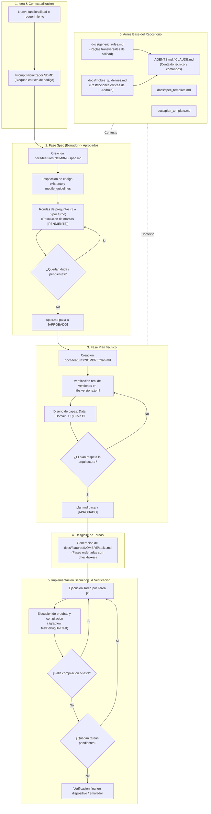

# Metodologia SDMD: Spec-Driven Mobile Development en MiraiLink

Este documento describe la adopcion formal del estandar **SDMD (Spec-Driven Mobile Development)** en MiraiLink, adaptando los principios de Spec-Driven Development al ecosistema Android y a las particularidades de esta aplicacion (Clean Architecture, Jetpack Compose, Koin, Room Database offline y Socket.IO).

- - -

## 1. Resumen Ejecutivo y Filosofia de Diseno

### 1.1. El Problema: Indeterminismo y el Sesgo del Happy Path
Los Modelos de Lenguaje Grande (LLMs) y asistentes de codificacion presentan tres riesgos criticos en desarrollo movil cuando se les solicita codigo directamente:
1. **Sesgo del Happy Path**: Suponen conectividad ininterrumpida, respuestas instantaneas del servidor y memoria ilimitada, descuidando estados vacios, timeouts y perdida de red.
2. **Desconexion del Ciclo de Vida Movil**: Ignoran el ciclo de vida de Android (destruccion de procesos por escasez de memoria mediante Low Memory Killer, rotacion de pantalla y restauracion de estado).
3. **Alucinacion de Dependencias**: Proponen metodos obsoletos o librerias incompatibles con el Gradle Version Catalog (`libs.versions.toml`), KSP o la version configurada de Kotlin.

### 1.2. La Solucion: El Arnes de Seguridad (Safety Harness)
SDMD establece un protocolo estricto: **el codigo de produccion nunca se genera directamente a partir de una idea**.

Entre la intencion inicial y la primera linea de codigo ejecutable se despliega un arnes de seguridad documental:
- Se inspecciona el repositorio antes de asumir (`architecture.md`, `codebase-map.md`, `libs.versions.toml`).
- Se encapsulan las decisiones funcionales en `spec.md`.
- Se auditan las limitaciones moviles con `mobile_guidelines.md`.
- Se disena la arquitectura tecnica con dependencias reales en `plan.md`.
- Se desglosa en tareas atomicas y testeables en `tasks.md`.

- - -

## 2. Enfoque Adoptado: Spec-Anchor

MiraiLink adopta el modelo **Spec-Anchor** para la gestion de especificaciones:
- Las especificaciones se redactan, aprueban y versionan en Git dentro de `docs/features/<nombre-feature>/`.
- Conveven de forma permanente con el codigo fuente.
- Garantizan memoria historica para futuros desarrolladores y agentes de IA, evitando regresiones arquitectonicas.

- - -

## 3. Diagrama de Flujo Mermaid del Ciclo SDMD



- - -

## 4. Estructura de Documentos en el Repositorio

```text
MiraiLink/
├── AGENTS.md                      # Contexto global y comandos para asistentes IA
├── CLAUDE.md                      # Puntero de contexto para Claude
├── docs/
│   ├── generic_rules.md           # Reglas universales de codigo y Clean Architecture
│   ├── mobile_guidelines.md       # Restricciones criticas de Android (Lifecycle, Offline, UI)
│   ├── spec_template.md           # Plantilla canonica de especificacion funcional
│   ├── plan_template.md           # Plantilla canonica de plan tecnico
│   ├── PROMPTS.md                 # Prompts inicializadores canonicos para desarrolladores e IA
│   ├── SDMD.md                    # Esta guia metodologica
│   └── features/                  # Directorio persistente de features (Spec-Anchor)
│       └── <nombre-feature>/
│           ├── spec.md            # Especificacion aprobada
│           ├── plan.md            # Plan tecnico aprobado
│           └── tasks.md           # Checklist secuencial de tareas
```

- - -

## 5. Guia de Ejecucion Paso a Paso

1. **Paso 0 (Arnes Base)**: Mantener actualizadas las directrices en `docs/generic_rules.md` y `docs/mobile_guidelines.md`.
2. **Paso 1 (Contextualizacion)**: Al recibir un nuevo requerimiento, bloquear cualquier intento de generacion de codigo de produccion.
3. **Paso 2 (Especificacion)**: Copiar `docs/spec_template.md` a `docs/features/<feature>/spec.md`. Marcar dudas con `[PENDIENTE]` y ejecutar rondas de 3 a 5 preguntas concretas.
4. **Paso 3 (Plan Tecnico)**: Copiar `docs/plan_template.md` a `docs/features/<feature>/plan.md`. Comprobar versiones en `gradle/libs.versions.toml` y definir contratos de DAOs, repositorios con `Flow`, modelos y ViewModels.
5. **Paso 4 (Tareas)**: Crear `docs/features/<feature>/tasks.md` estructurado en fases con tests asociados.
6. **Paso 5 (Implementacion)**: Resolver una tarea a la vez. Compilar (`./gradlew assembleDebug`) y pasar tests unitarios (`./gradlew testDebugUnitTest`) antes de marcar `[x]`.
7. **Paso 6 (Verificacion)**: Probar en emulador o dispositivo fisico, validando rotacion, falta de conexion y ergonomia tactil.
