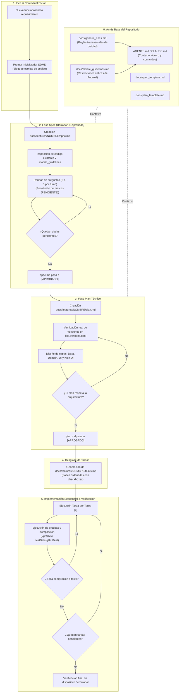

# Metodología SDMD: Spec-Driven Mobile Development en MiraiLink

Este documento describe la adopción formal del estándar **SDMD (Spec-Driven Mobile Development)** en MiraiLink, adaptando los principios de Spec-Driven Development al ecosistema Android y a las particularidades de esta aplicación (Clean Architecture, Jetpack Compose, Koin, Room Database offline y Socket.IO).

- - -

## 1. Resumen Ejecutivo y Filosofia de Diseño

### 1.1. El Problema: Indeterminismo y el Sesgo del Happy Path
Los Modelos de Lenguaje Grande (LLMs) y asistentes de codificación presentan tres riesgos críticos en desarrollo móvil cuando se les solicita código directamente:
1. **Sesgo del Happy Path**: Suponen conectividad ininterrumpida, respuestas instantaneas del servidor y memoria ilimitada, descuidando estados vacíos, timeouts y pérdida de red.
2. **Desconexión del Ciclo de Vida Móvil**: Ignoran el ciclo de vida de Android (destrucción de procesos por escasez de memoria mediante Low Memory Killer, rotación de pantalla y restauración de estado).
3. **Alucinación de Dependencias**: Proponen métodos obsoletos o librerías incompatibles con el Gradle Version Catalog (`libs.versions.toml`), KSP o la versión configurada de Kotlin.

### 1.2. La Solución: El Arnés de Seguridad (Safety Harness)
SDMD establece un protocolo estricto: **el código de producción nunca se genera directamente a partir de una idea**.

Entre la intención inicial y la primera línea de código ejecutable se despliega un arnés de seguridad documental:
- Se inspecciona el repositorio antes de asumir (`architecture.md`, `codebase-map.md`, `libs.versions.toml`).
- Se encapsulan las decisiones funcionales en `spec.md`.
- Se auditan las limitaciones móviles con `mobile_guidelines.md`.
- Se disena la arquitectura técnica con dependencias reales en `plan.md`.
- Se desglosa en tareas atómicas y testeables en `tasks.md`.

- - -

## 2. Enfoque Adoptado: Spec-Anchor

MiraiLink adopta el modelo **Spec-Anchor** para la gestión de especificaciones:
- Las especificaciones se redactan, aprueban y versionan en Git dentro de `docs/features/<nombre-feature>/`.
- Conveven de forma permanente con el código fuente.
- Garantizan memoria histórica para futuros desarrolladores y agentes de IA, evitando regresiones arquitectónicas.

- - -

## 3. Diagrama de Flujo Mermaid del Ciclo SDMD


```mermaid
flowchart TD
    subgraph F0["0. Arnés Base del Repositorio"]
        AG["AGENTS.md / CLAUDE.md<br/>(Contexto técnico y comandos)"]
        GR["docs/generic_rules.md<br/>(Reglas transversales de calidad)"]
        MG["docs/mobile_guidelines.md<br/>(Restricciones críticas de Android)"]
        ST["docs/spec_template.md"]
        PT["docs/plan_template.md"]
        GR --> AG
        MG --> AG
    end

    subgraph F1["1. Idea & Contextualización"]
        IDEA["Nueva funcionalidad o requerimiento"] --> PROMPT_INIT["Prompt Inicializador SDMD<br/>(Bloqueo estricto de código)"]
    end

    subgraph F2["2. Fase Spec (Borrador -> Aprobado)"]
        PROMPT_INIT --> DRAFT_SPEC["Creación docs/features/NOMBRE/spec.md"]
        DRAFT_SPEC --> INSPECT["Inspección de código existente y mobile_guidelines"]
        INSPECT --> Q_ROUNDS["Rondas de preguntas (3 a 5 por turno)<br/>(Resolución de marcas [PENDIENTE])"]
        Q_ROUNDS --> REVIEW_SPEC{"¿Quedan dudas pendientes?"}
        REVIEW_SPEC -- Si --> Q_ROUNDS
        REVIEW_SPEC -- No --> SPEC_OK["spec.md pasa a [APROBADO]"]
    end

    subgraph F3["3. Fase Plan Técnico"]
        SPEC_OK --> DRAFT_PLAN["Creación docs/features/NOMBRE/plan.md"]
        DRAFT_PLAN --> DEP_CHECK["Verificación real de versiones en libs.versions.toml"]
        DEP_CHECK --> ARCH["Diseño de capas: Data, Domain, UI y Koin DI"]
        ARCH --> REVIEW_PLAN{"¿El plan respeta la arquitectura?"}
        REVIEW_PLAN -- No --> DEP_CHECK
        REVIEW_PLAN -- Si --> PLAN_OK["plan.md pasa a [APROBADO]"]
    end

    subgraph F4["4. Desglose de Tareas"]
        PLAN_OK --> TASKS["Generación de docs/features/NOMBRE/tasks.md<br/>(Fases ordenadas con checkboxes)"]
    end

    subgraph F5["5. Implementación Secuencial & Verificación"]
        TASKS --> EXEC["Ejecución Tarea por Tarea [x]"]
        EXEC --> TESTS["Ejecución de pruebas y compilación<br/>(./gradlew testDebugUnitTest)"]
        TESTS --> TEST_FAIL{"¿Falla compilación o tests?"}
        TEST_FAIL -- Si --> EXEC
        TEST_FAIL -- No --> HAS_NEXT{"¿Quedan tareas pendientes?"}
        HAS_NEXT -- Si --> EXEC
        HAS_NEXT -- No --> DEVICE_VAL["Verificación final en dispositivo / emulador"]
    end

    F0 -. Contexto .- F2
    F0 -. Contexto .- F3
```

- - -

## 4. Estructura de Documentos en el Repositorio

```text
MiraiLink/
├── AGENTS.md                      # Contexto global y comandos para asistentes IA
├── CLAUDE.md                      # Puntero de contexto para Claude
├── docs/
│   ├── generic_rules.md           # Reglas universales de código y Clean Architecture
│   ├── mobile_guidelines.md       # Restricciones críticas de Android (Lifecycle, Offline, UI)
│   ├── spec_template.md           # Plantilla canónica de especificación funcional
│   ├── plan_template.md           # Plantilla canónica de plan técnico
│   ├── PROMPTS.md                 # Prompts inicializadores canónicos para desarrolladores e IA
│   ├── SDMD.md                    # Esta guía metodológica
│   └── features/                  # Directorio persistente de features (Spec-Anchor)
│       └── <nombre-feature>/
│           ├── spec.md            # Especificación aprobada
│           ├── plan.md            # Plan técnico aprobado
│           └── tasks.md           # Checklist secuencial de tareas
```

- - -

## 5. Guía de Ejecución Paso a Paso

1. **Paso 0 (Arnés Base)**: Mantener actualizadas las directrices en `docs/generic_rules.md` y `docs/mobile_guidelines.md`.
2. **Paso 1 (Contextualización)**: Al recibir un nuevo requerimiento, bloquear cualquier intento de generación de código de producción.
3. **Paso 2 (Especificación)**: Copiar `docs/spec_template.md` a `docs/features/<feature>/spec.md`. Marcar dudas con `[PENDIENTE]` y ejecutar rondas de 3 a 5 preguntas concretas.
4. **Paso 3 (Plan Técnico)**: Copiar `docs/plan_template.md` a `docs/features/<feature>/plan.md`. Comprobar versiones en `gradle/libs.versions.toml` y definir contratos de DAOs, repositorios con `Flow`, modelos y ViewModels.
5. **Paso 4 (Tareas)**: Crear `docs/features/<feature>/tasks.md` estructurado en fases con tests asociados.
6. **Paso 5 (Implementación)**: Resolver una tarea a la vez. Compilar (`./gradlew assembleDebug`) y pasar tests unitarios (`./gradlew testDebugUnitTest`) antes de marcar `[x]`.
7. **Paso 6 (Verificación)**: Probar en emulador o dispositivo físico, validando rotación, falta de conexión y ergonomía táctil.
