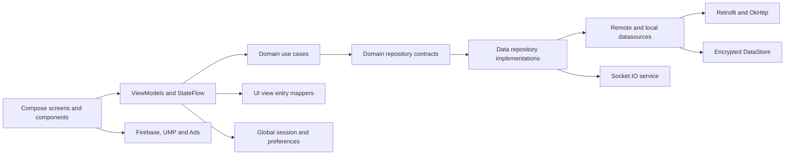
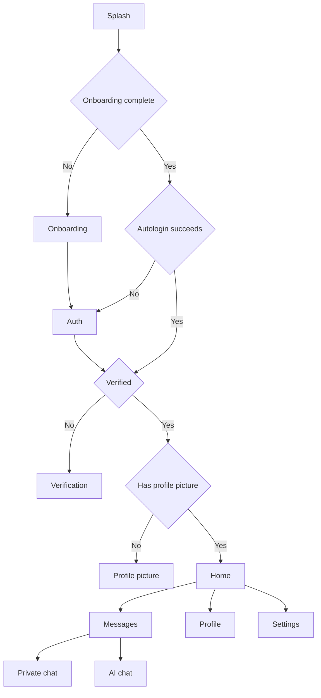

# Arquitectura real

## Resumen

MiraiLink es un monolito Android de un solo módulo con separación de paquetes por capas. La dirección principal de trabajo es UI, ViewModel, caso de uso, contrato de repositorio, implementación, datasource e integración externa. La separación es útil, pero no es Clean Architecture estricta porque `domain` y `data` conservan varias dependencias hacia Android y UI.

## Capas y responsabilidades

### Presentación

`ui` contiene 100 archivos Kotlin:

- Pantallas Compose y ViewModels por flujo funcional.
- Componentes reutilizables organizados como atoms, molecules y grupos específicos de chat, media, usuario, match, barras y 2FA.
- Navigation 3, rutas serializables, pilas por subgrafo y analítica de pantalla.
- View entries específicos de presentación.
- Tema, utilidades Compose y extensiones Android.

Los ViewModels usan principalmente `StateFlow`, `MutableStateFlow`, `viewModelScope`, dispatchers inyectados y `MiraiLinkResult`. No hay una única convención de estado: algunas pantallas usan sealed UI states, Profile usa intents y eventos, y otras exponen varios flujos independientes.

### Dominio

`domain` contiene 85 archivos Kotlin:

- 12 contratos de repositorio.
- 49 casos de uso aproximadamente, agrupados por autenticación, 2FA, catálogo, chat, feed, feedback, match, notificaciones, onboarding, fotos, reportes, swipes y usuarios.
- Modelos de usuario, catálogo, chat y versión.
- Contratos de telemetría, resultado genérico y utilidades.

No es una capa independiente de plataforma. Se encontraron dependencias directas a `android.net.Uri`, `android.content.Context`, `android.util.Log`, Android Credentials, Retrofit, Firebase y view entries de UI. Cualquier modularización futura debe extraer o abstraer esas dependencias primero.

### Datos

`data` contiene 91 archivos Kotlin:

- 10 interfaces Retrofit, un interceptor y un servicio Socket.IO.
- 11 datasources, 12 implementaciones de repositorio y mappers DTO a dominio.
- Modelos request, response, DTO y modelos locales serializables.
- DataStore cifrado, gestor de sesión, telemetría Firebase, Ads y utilidades Android.

Existen mappers bajo `data/mappers/ui` que crean view entries de `ui`. También hay ViewModels que importan estos mappers directamente. Esto acopla presentación y datos en ambos sentidos.

### Core, estado y plataforma

- `core/featureflags` persiste el flag de tema navideño en Preferences DataStore.
- `core/remoteconfig` envuelve Firebase Remote Config.
- `state/GlobalMiraiLinkSession` expone autenticación, verificación, usuario, foto y configuración de barras.
- `state/GlobalMiraiLinkPrefs` expone el estado de onboarding.
- `notification` crea canales y `service/FcmService` recibe mensajes y tokens FCM.
- `di/koin` contiene 15 módulos activos y sus qualifiers.

## Arranque de la aplicación

1. Android crea `MiraiLinkApp` desde el manifest.
2. `MiraiLinkApp.onCreate` inicia Koin con los 15 módulos y la instrumentación de Kotzilla.
3. `MainActivity` activa edge to edge y configura dispositivos de prueba de Ads solo en debug.
4. Crea el canal de notificaciones.
5. Inicializa Firebase y registra `DebugAppCheckProviderFactory` sin comprobar el build type.
6. Solicita el token FCM y lo envía al backend si la sesión aparece como autenticada en 1,5 segundos.
7. Inicializa AdMob y programa un intento de interstitial tras 10 segundos y cada 5 minutos mientras la Activity esté resumed.
8. Compose observa feature flags y crea `MiraiLinkAppRoot`.
9. La raíz solicita permiso de notificaciones, resuelve consentimiento UMP, controla telemetría y vuelve a inicializar Mobile Ads.
10. `NavWrapper` crea las pilas de Navigation 3 y decide el destino según onboarding, autenticación, verificación y foto de perfil.

## Navegación

Hay tres rutas de nivel superior con pilas guardables:

- `SplashScreen`
- `ScreensSubgraphs.Auth`
- `ScreensSubgraphs.Main`

Las rutas concretas son Splash, Onboarding, Auth, RecoverPassword, Verification, ProfilePicture, Home, Messages, Chat, AiChat, Settings, Profile, Feedback y ConfigureTwoFactor.

El flujo central es:

`GlobalMiraiLinkSession` actúa como fuente de estado para las transiciones principales. `NavWrapper` reacciona a logout y a cambios en autenticación, usuario, verificación y foto. Las barras superior e inferior también se controlan desde este estado global.

Los intent filters HTTPS existen en el manifest para `mirailink.xyz`, pero no se encontró lectura de `Intent.data`, `onNewIntent` ni traducción de URI a `AppScreen`. Por tanto, la declaración de deep links no implementa navegación profunda completa.

## Inyección de dependencias

Koin inicia estos módulos:

| Módulo | Responsabilidad |
| --- | --- |
| `appModule` | Estado global, MainViewModel, Remote Config y Ads |
| `aiModule` | Firebase AI, Gemini datasource, repositorio y caso de uso |
| `cryptoModule` | Clave AES-GCM en Android Keystore |
| `dataModule` | Gestores locales y datasources |
| `dataStoreModule` | DataStores cifrados y migraciones |
| `dispatchersModule` | IO, Default, Main y scope de aplicación |
| `featureFlagModule` | Feature flags y AppThemeManager |
| `loggerModule` | Logger Android |
| `networkModule` | URLs, OkHttp, Retrofit y servicios API |
| `repositoryModule` | Implementaciones de contratos de dominio |
| `serializationModule` | Configuración JSON |
| `socketModule` | SocketService inicializado con la URL base |
| `telemetryModule` | Firebase Analytics y Crashlytics |
| `useCaseModule` | Factorías de casos de uso |
| `viewModelModule` | ViewModels y sus qualifiers |

`AiRepository` se registra tanto en `aiModule` como en `repositoryModule`. Debe mantenerse una sola fuente de binding para evitar ambigüedad y orden implícito.

## Estado y persistencia

- `Session` contiene token, user ID y verificación.
- `AppPrefs` contiene el estado de onboarding.
- Ambos se serializan como JSON cifrado con AES-256-GCM.
- La clave se genera y conserva en Android Keystore con alias `ml_aes_gcm_v1`.
- El IV de 12 bytes se antepone al payload cifrado.
- Hay migraciones desde SharedPreferences y un Preferences DataStore antiguo para sesión.
- `SessionManager` mantiene caches volátiles para que el interceptor OkHttp pueda leer el token de forma síncrona.
- Los DataStores principales quedan excluidos de backup y device transfer mediante XML.

## Concurrencia

- Los ViewModels lanzan trabajo en `viewModelScope` y cambian a dispatchers inyectados.
- Koin crea un scope de aplicación con `SupervisorJob` e IO.
- `GlobalMiraiLinkSession` observa la sesión y sondea la foto de perfil con backoff de 10 a 120 segundos.
- `ChatViewModel` sondea mensajes cada 3 segundos.
- `MainActivity` mantiene un bucle de Ads cada 5 minutos mientras esté resumed.
- Los caches síncronos de sesión se actualizan desde un collector de DataStore.

## Límites y deuda arquitectónica

- La separación Clean es nominal, no estricta.
- El módulo único aumenta el alcance de compilación y permite dependencias cruzadas sin barreras Gradle.
- `NavWrapper`, `UserCard`, `AuthScreen`, `Theme` y varios ViewModels son puntos de alta concentración de lógica.
- El estado de Messages se actualiza desde dos cargas concurrentes que pueden sobrescribir estados Loading, Success o Error.
- Socket.IO y el sondeo REST representan dos diseños de chat parcialmente superpuestos.
- Remote Config define `initialize`, pero no existe ninguna llamada a ese método.
- El flujo de chat de grupo está marcado como TODO y se inicia con un ID vacío.
