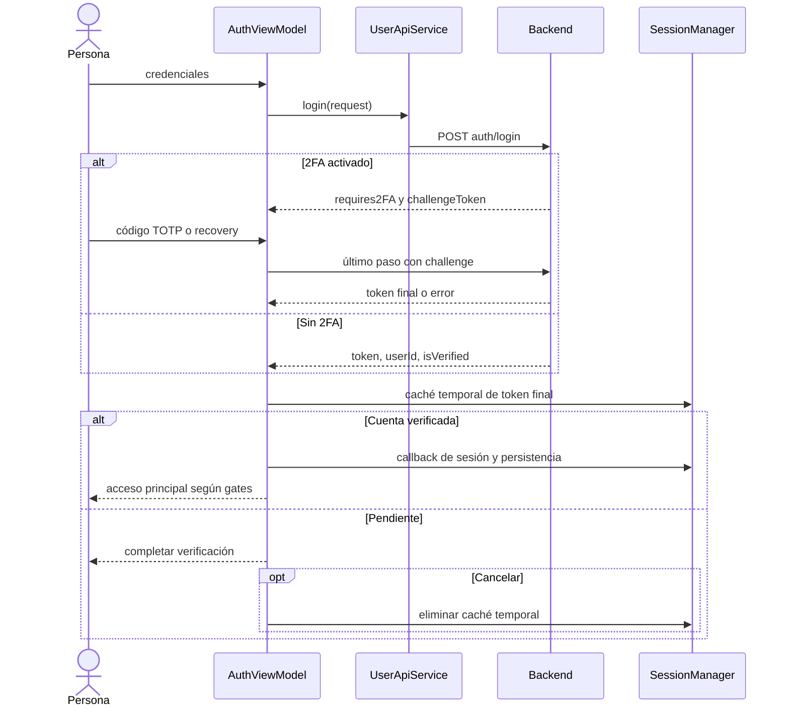

# Acceso y token pendiente

[Índice](indice.md) | [Guía maestra](../../guia-maestra.md)

Tipo: UML de secuencia. Revisión: 2026-10-01. Fuentes: [app/src/main/java/com/feryaeljustice/mirailink/ui/screens/auth/AuthViewModel.kt](../../../app/src/main/java/com/feryaeljustice/mirailink/ui/screens/auth/AuthViewModel.kt), [app/src/main/java/com/feryaeljustice/mirailink/data/datastore/SessionManager.kt](../../../app/src/main/java/com/feryaeljustice/mirailink/data/datastore/SessionManager.kt).

El challenge no se persiste como access token. El callback conecta la sesión con la raíz; el guardado de contraseña en Credential Manager es otro efecto cancelable. Ver el backend para TTL y procesamiento criptográfico.
