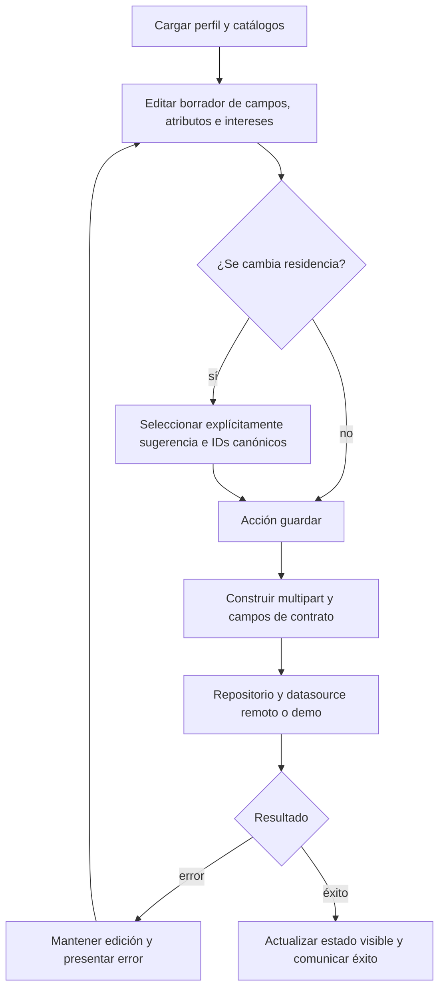

# Actividad de edición y guardado del perfil

[Índice](indice.md) | [Recorrido de perfil](../flujos/perfil.md).

Tipo: actividad representada como flowchart. Fuente: [ProfileViewModel.kt](../../../app/src/main/java/com/feryaeljustice/mirailink/ui/screens/profile/ProfileViewModel.kt) y [UserRemoteDataSource.kt](../../../app/src/main/java/com/feryaeljustice/mirailink/data/datasource/UserRemoteDataSource.kt). Revisión: 2026-10-01.

Vista del recorrido de edición, sin afirmar atomicidad entre archivos y PostgreSQL. La confirmación de IDs de residencia y la carga individual de foto requieren sus propios handlers; ver el flujo y sus enlaces al servidor.
