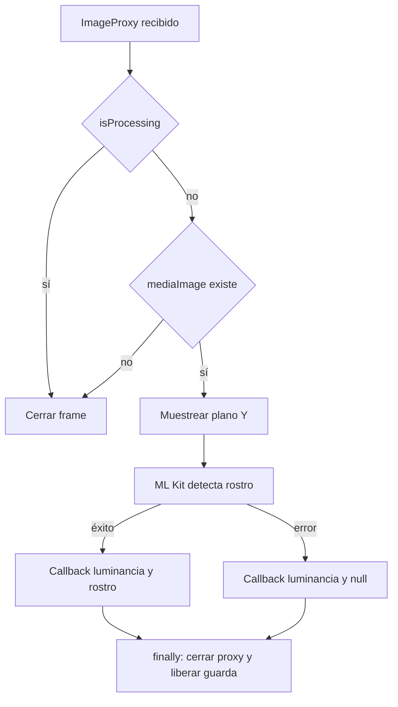

# Actividad del análisis de cámara

[Índice](indice.md) | [Guía maestra](../../guia-maestra.md)

Tipo: actividad representada como flowchart. Revisión: 2026-10-01. Fuentes: [app/src/main/java/com/feryaeljustice/mirailink/data/studio/StudioPhotoAnalyzer.kt](../../../app/src/main/java/com/feryaeljustice/mirailink/data/studio/StudioPhotoAnalyzer.kt).

No representa identificación de una persona. La guarda reduce procesamiento simultáneo, y finally libera el frame del camino asíncrono. Permisos/captura ocurren antes de este analizador.
