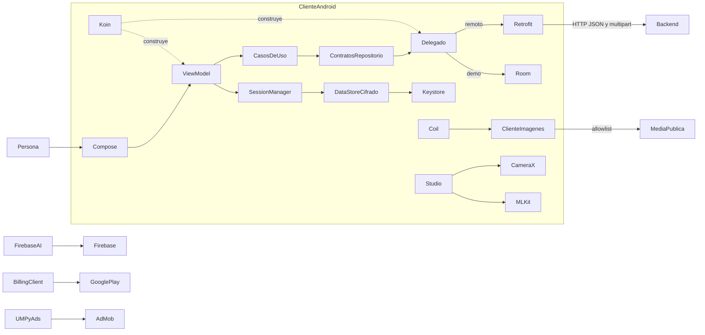

# Contexto, componentes y dependencias del cliente

[Índice](indice.md) | [Guía maestra](../../guia-maestra.md)

Tipo: contexto/componentes; representación estructural. Revisión: 2026-10-01. Fuentes: [app/src/main/java/com/feryaeljustice/mirailink/MiraiLinkApp.kt](../../../app/src/main/java/com/feryaeljustice/mirailink/MiraiLinkApp.kt), [app/src/main/java/com/feryaeljustice/mirailink/di/koin/RepositoryModule.kt](../../../app/src/main/java/com/feryaeljustice/mirailink/di/koin/RepositoryModule.kt).

Los repositorios delegados no cubren todos los contratos. Las flechas son dependencias y llamadas, no una garantía de aislamiento de capas. Backend, Firebase y Google Play son servicios distintos. SocketService existe como infraestructura y no describe el polling visible.
