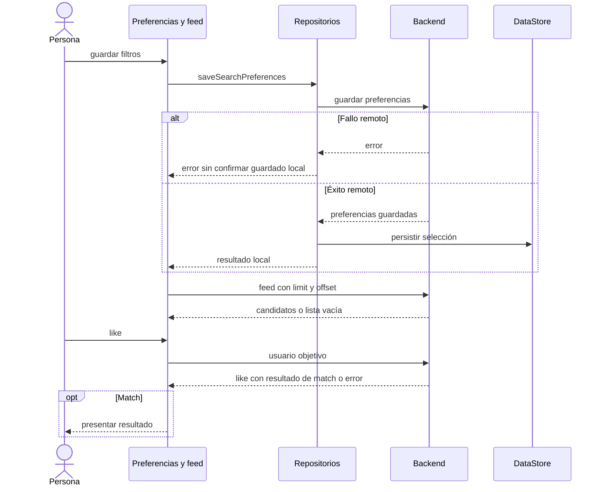

# Búsqueda, feed y acción de like

[Índice](indice.md) | [Recorrido de descubrimiento](../flujos/descubrimiento.md).

Tipo: secuencia. Fuentes: [SearchPreferencesRepositoryImpl.kt](../../../app/src/main/java/com/feryaeljustice/mirailink/data/repository/SearchPreferencesRepositoryImpl.kt), [SwipeApiService.kt](../../../app/src/main/java/com/feryaeljustice/mirailink/data/remote/SwipeApiService.kt) y [MatchApiService.kt](../../../app/src/main/java/com/feryaeljustice/mirailink/data/remote/MatchApiService.kt). Revisión: 2026-10-01.

El backend decide ranking, exclusiones y límites. La escritura remota y local no comparten transacción. Un match no implica creación inmediata de chat; la creación pertenece al envío de mensajes en el servidor. Los repositorios demo siguen otro recorrido local.
