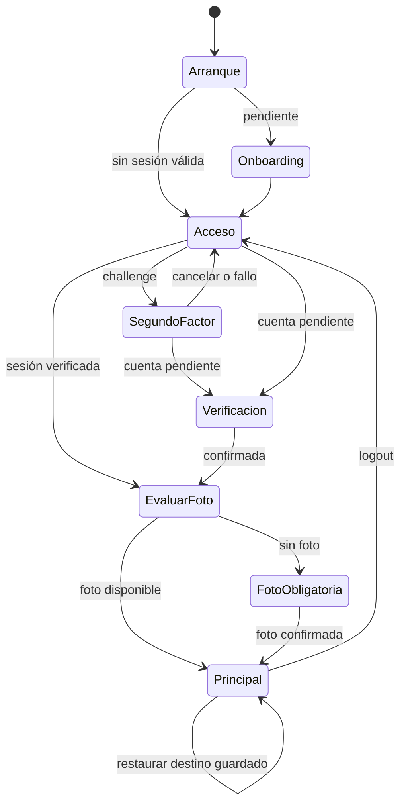

# Estados de sesión y navegación

[Índice](indice.md) | [Guía maestra](../../guia-maestra.md)

Tipo: UML de estados, vista resumida. Revisión: 2026-10-01. Fuentes: [app/src/main/java/com/feryaeljustice/mirailink/ui/navigation/NavWrapper.kt](../../../app/src/main/java/com/feryaeljustice/mirailink/ui/navigation/NavWrapper.kt), [app/src/main/java/com/feryaeljustice/mirailink/ui/navigation/AuthenticatedNavigationPolicy.kt](../../../app/src/main/java/com/feryaeljustice/mirailink/ui/navigation/AuthenticatedNavigationPolicy.kt).

Resume gates de sesión. La actualización obligatoria puede bloquear acceso adicionalmente; onboarding/splash y eventos de URI deben contrastarse con NavWrapper. Restaurar navegación no asegura persistencia de cada formulario.
