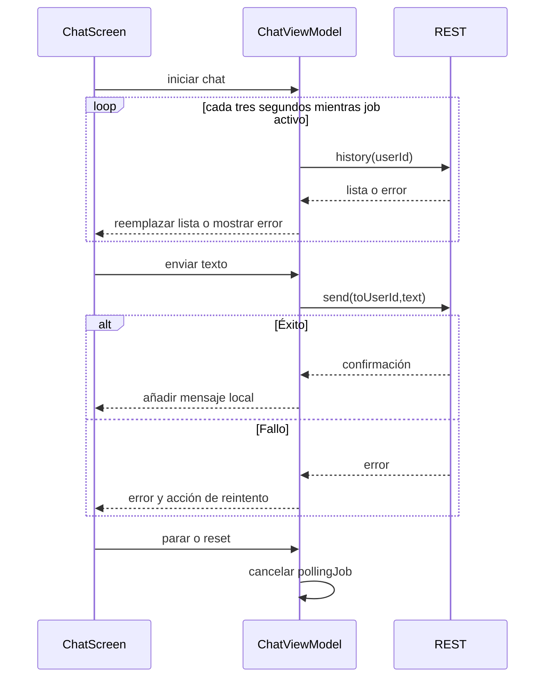

# Polling y envío de chat

[Índice](indice.md) | [Guía maestra](../../guia-maestra.md)

Tipo: UML de secuencia. Revisión: 2026-10-01. Fuentes: [app/src/main/java/com/feryaeljustice/mirailink/ui/screens/chat/ChatViewModel.kt](../../../app/src/main/java/com/feryaeljustice/mirailink/ui/screens/chat/ChatViewModel.kt).

Las llamadas a getMessages lanzan jobs hijos independientes y pueden solaparse si son lentas. El envío visible no es optimista antes del resultado REST ni usa una outbox persistente.
