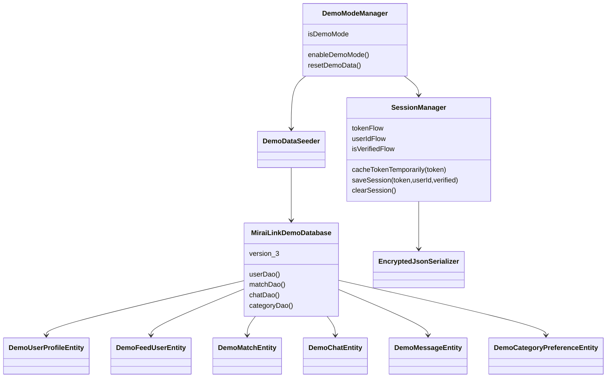

# Modelos y persistencia demo

[Índice](indice.md) | [Guía maestra](../../guia-maestra.md)

Tipo: UML de clases simplificado. Revisión: 2026-10-01. Fuentes: [app/src/main/java/com/feryaeljustice/mirailink/data/local/demo/MiraiLinkDemoDatabase.kt](../../../app/src/main/java/com/feryaeljustice/mirailink/data/local/demo/MiraiLinkDemoDatabase.kt), [app/src/main/java/com/feryaeljustice/mirailink/data/datastore/SessionManager.kt](../../../app/src/main/java/com/feryaeljustice/mirailink/data/datastore/SessionManager.kt).

Relaciones de uso y almacenamiento, no claves foráneas inferidas. La clase database agrega entidades; consultar cada Entity/DAO para columnas y consultas. Room demo y DataStore de sesión son almacenes distintos.
