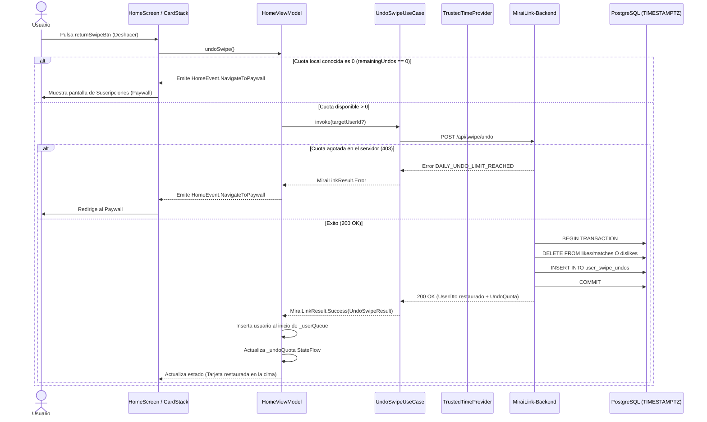

# Sistema de Deshacer en Discovery e Integridad Temporal (TrustedTime & Timezones)

Este documento detalla la arquitectura, el funcionamiento integral, la estrategia de seguridad contra manipulación horaria y los procedimientos de despliegue para el sistema de rebobinado (**Undo Swipe**) en MiraiLink.

- - -

## 1. Visión General

El sistema permite a los usuarios rebobinar (deshacer) su decisión más reciente de interacción (like o dislike) en la pantalla principal de descubrimiento (**Home / Discovery**).

### Objetivos Clave
1. **Control de Cuotas por Nivel de Suscripción**:
   - **Plan Free**: 1 deshacer por ventana de 24 horas.
   - **Plan Plus**: 3 deshaceres por ventana de 24 horas.
   - **Plan Premium**: 6 deshaceres por ventana de 24 horas.
2. **Ventana Deslizante de 24 Horas**: La cuota no se reinicia a una hora fija local (como medianoche), sino que se computa de forma continua (`NOW() - INTERVAL '24 hours'`). Cada deshacer utilizado se recupera exactamente 24 horas después de haberse ejecutado.
3. **Rebobinado Multisesión**: Es posible deshacer votos emitidos en sesiones anteriores o días pasados incluso si el usuario cerro la app o el proceso fue destruido por el sistema operativo.
4. **Integridad Temporal Inalterable**: Protección absoluta contra manipulaciones locales del reloj, zonas horarias o idioma en los Ajustes del dispositivo Android.
5. **Transaccionalidad Atómica**: Si un like habia generado un match mutuo, la reversión elimina de forma atómica tanto el like como el match en la base de datos (PostgreSQL en producción o Room en Modo Demo).

- - -

## 2. Diagrama de Arquitectura y Flujo



- - -

## 3. Blindaje contra Manipulación Temporal (Anti-Tampering)

Para evitar que los usuarios burlen los límites diarios cambiando manualmente la fecha, hora, zona horaria o región en los Ajustes de Android, se implementó una estrategia jerárquica de tiempo de confianza:

```
+--------------------------------------------------------------------------+
|                       TrustedTimeProviderImpl                            |
+--------------------------------------------------------------------------+
| 1. Google Play Services TrustedTime API                                  |
|    - TrustedTime.createClient(context)                                   |
|    - computeCurrentUnixEpochMillis()                                     |
|    - Protegido criptograficamente por los servidores de Google.          |
+--------------------------------------------------------------------------+
| 2. Fallback de Red + Reloj Monotónico de Hardware                        |
|    - Sincronización de cabecera HTTP Date mediante ServerTimeInterceptor |
|    - Anclado con SystemClock.elapsedRealtime()                           |
|    - El tiempo avanza con los ticks de la CPU, inmune a cambios del OS.  |
+--------------------------------------------------------------------------+
| 3. Fallback Monotónico Local de Arranque de Proceso                      |
|    - Registro de tiempo de inicio + delta de SystemClock.elapsedRealtime |
+--------------------------------------------------------------------------+
| 4. Servidor como Fuente de Verdad Absoluta                               |
|    - PostgreSQL evalúa: created_at >= NOW() - INTERVAL '24 hours'        |
|    - Todas las columnas migradas a TIMESTAMPTZ (UTC).                    |
+--------------------------------------------------------------------------+
```

### Componentes de Tiempo en Android
- **`TrustedTimeProvider`**: Interfaz de dominio que provee `currentTimeMillis()`, `isTimeTrusted()` y `syncWithServerTime()`.
- **`TrustedTimeProviderImpl`**: Implementación que consulta en primer lugar el cliente de Google Play Services (`play-services-time:16.0.1`), y si no está disponible (por ejemplo, arranque sin red o dispositivos sin GMS), calcula el tiempo sumando la diferencia transcurrida en el reloj monotónico de hardware a la última marca temporal confirmada por el servidor.
- **`ServerTimeInterceptor`**: Interceptor de OkHttp que lee la cabecera HTTP estándar `Date` (formato RFC 1123/2822) de cada respuesta exitosa del backend y la traslada a `TrustedTimeProvider.syncWithServerTime()`.

- - -

## 4. Cuotas y Rebobinado Multisesión

### 4.1. Reglas de Negocio
- **Consecutivos**: El usuario puede pulsar deshacer de manera consecutiva tantas veces como su cuota lo permita (1 vez en Free, hasta 3 en Plus, hasta 6 en Premium).
- **Sesiones Previas**:
  - Si el usuario reinicia la aplicación o entra tras varios días, la memoria volátil de la cola está vacía.
  - Sin embargo, `GET /api/swipe/undo-quota` consulta en PostgreSQL si existen registros en `likes` o `dislikes`. Si existen, retorna `hasUndoableSwipe: true`.
  - El botón de la interfaz `returnSwipeBtn` permanece activo.
  - Al pulsarlo, el backend toma el voto más reciente de la base de datos, lo revierte, audita el consumo y devuelve el perfil completo para situarlo de inmediato en la pantalla de descubrimiento.

### 4.2. Modo Demo (Room Offline)
En el entorno sin conexión o de demostración, el comportamiento es idéntico y transparente:
- `DemoSwipeHistoryEntity`: Almacena en SQLite de Room cada swipe (`action: "like"|"dislike"`, `timestamp: Long`).
- `DemoSwipeUndoEntity`: Almacena cada operación de deshacer (`undoneAt: Long`).
- `DemoSwipeRepositoryImpl`: Evalúa la ventana de 24 horas usando `TrustedTimeProvider` y revierte de forma atómica las tablas simuladas de matches, chats y mensajes.

- - -

## 5. Base de Datos PostgreSQL y Migración

### 5.1. Estandarización TIMESTAMPTZ
La migración `010_timezone_and_swipe_undo_quota.sql`:
1. Convierte de forma segura todas las columnas históricas de tipo `TIMESTAMP` ingenuo a `TIMESTAMPTZ` interpretando los valores previos en UTC (`USING column_name AT TIME ZONE 'UTC'`).
2. Las tablas actualizadas incluyen: `users`, `user_location_history`, `token_blacklist`, `verification_tokens`, `password_reset_tokens`, `likes`, `dislikes`, `matches`, `chats`, `chat_members`, `messages`, `push_tokens`, `reports` y `feedback`.

### 5.2. Tabla de Auditoría de Deshaceres
```sql
CREATE TABLE IF NOT EXISTS user_swipe_undos (
    id UUID PRIMARY KEY DEFAULT gen_random_uuid(),
    user_id UUID NOT NULL REFERENCES users(id) ON DELETE CASCADE,
    target_user_id UUID NOT NULL REFERENCES users(id) ON DELETE CASCADE,
    action_undone VARCHAR(10) NOT NULL CHECK (action_undone IN ('like', 'dislike')),
    created_at TIMESTAMPTZ NOT NULL DEFAULT NOW()
);

CREATE INDEX IF NOT EXISTS idx_user_swipe_undos_user_created 
ON user_swipe_undos (user_id, created_at DESC);
```

- - -

## 6. Referencia de Archivos de Código

### Backend (`MiraiLink-Backend`)
- Contrato OpenAPI: `docs/openapi.yaml`
- Rutas: `src/routes/swipe.routes.js`
- Controlador: `src/controllers/swipe.controller.js` (`getUndoQuota`, `undoSwipe`, `getUserSubscriptionTier`, `getTierUndoLimit`)
- Límites de Suscripción: `src/consts/subscriptionConsts.js` (`UNDO_DAILY_LIMITS`)
- Esquema Maestro: `src/database/db.sql`
- Migración: `src/database/migrations/010_timezone_and_swipe_undo_quota.sql`
- Tests: `tests/unit/controllers/swipe.controller.test.js`

### Android (`MiraiLink`)
- Tiempo de Confianza:
  - `app/src/main/java/com/feryaeljustice/mirailink/data/time/TrustedTimeProvider.kt`
  - `app/src/main/java/com/feryaeljustice/mirailink/data/remote/interceptor/ServerTimeInterceptor.kt`
- Modelos de Dominio:
  - `domain/model/swipe/UndoQuota.kt`
  - `domain/model/swipe/UndoSwipeResult.kt`
- Casos de Uso:
  - `domain/usecase/swipe/GetUndoQuotaUseCase.kt`
  - `domain/usecase/swipe/UndoSwipeUseCase.kt`
- Repositorios:
  - `data/repository/SwipeRepositoryImpl.kt`
  - `data/repository/delegating/DelegatingSwipeRepository.kt`
  - `data/repository/demo/DemoSwipeRepositoryImpl.kt`
- Presentación (UI/UX):
  - `ui/screens/home/HomeViewModel.kt`
  - `ui/screens/home/HomeScreen.kt`
- Tests Unitarios:
  - `app/src/test/java/com/feryaeljustice/mirailink/data/time/TrustedTimeProviderTest.kt`
  - `app/src/test/java/com/feryaeljustice/mirailink/domain/usecase/swipe/UndoSwipeUseCaseTest.kt`
  - `app/src/test/java/com/feryaeljustice/mirailink/ui/screens/home/HomeViewModelTest.kt`

- - -

## 7. Instrucciones para Despliegue en Servidor

Para poner en producción esta funcionalidad en el servidor del backend:

```bash
# 1. Acceder al repositorio del backend en el servidor
cd /ruta/hacia/MiraiLink-Backend

# 2. Obtener la rama con los cambios
git fetch origin
git checkout feature/discovery-undo-and-trusted-time
git pull origin feature/discovery-undo-and-trusted-time

# 3. Instalar dependencias si fuese necesario
npm install --production

# 4. Ejecutar la migración de base de datos
# Convierte columnas a TIMESTAMPTZ y crea user_swipe_undos con sus índices
npm run db:migrate

# 5. Reiniciar el proceso del backend (por ejemplo con PM2)
pm2 restart mirailink-backend

# 6. Comprobar logs de inicio
pm2 logs mirailink-backend --lines 50
```
