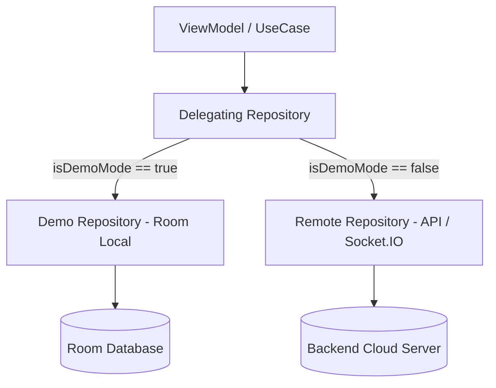

# Progreso de Implementación: Capa Offline Demo en MiraiLink

Este documento relata de forma detallada y humanizada el proceso completo de diseño, arquitectura, desarrollo, pruebas y validación del nuevo **Modo Demostración Offline** en MiraiLink.

---

## 1. El Desafío y la Visión

MiraiLink es una aplicación social y de citas diseñada para conectar usuarios en tiempo real mediante autenticación JWT, coincidencia basada en algoritmos remotos y mensajería instantánea a través de Socket.IO.

Sin un servidor backend activo o cuando un usuario desea evaluar la aplicación sin proporcionar datos privados o registrarse, la experiencia tradicional se veía bloqueada por una pantalla de inicio de sesión.

El objetivo de este desarrollo no fue convertir a MiraiLink en una red social completamente descentralizada (lo cual requeriría infraestructura P2P imposible para este tipo de aplicación), sino construir un **Modo Demostración Offline de alta fidelidad arquitectónica**:
- Entrada instantánea con un solo toque, sin credenciales.
- Inyección de perfiles locales realistas con intereses, animes y juegos favoritos.
- Simulación completa de deslizamiento (swipe), algoritmo de matching y respuestas conversacionales en tiempo real.
- Base de datos local transaccional mediante Room 2.8.4.
- Capacidad de editar el perfil local del usuario ficticio (`Hikari`).
- Mecanismo seguro de restauración a datos de fábrica del modo demo.
- Banner visual reactivo y no intrusivo advirtiendo que los perfiles y chats no corresponden a usuarios reales.

---

## 2. Decisiones de Arquitectura e Inversión de Dependencias (DIP)

Siguiendo Clean Architecture y los principios SOLID, la capa de dominio (`domain`) de MiraiLink nunca debe conocer si los datos provienen de un cluster remoto en la nube o de una base de datos local Room.

### 2.1 Repositorios Delegados (Pattern Delegating Repository)

Para evitar duplicar la lógica de los ViewModels y casos de uso, se implementó el patrón de repositorio delegado transparente:

1. **Interfaces de Dominio**:
   - `UserRepository`, `MatchRepository`, `SwipeRepository`, `ChatRepository`.

2. **Implementaciones Especializadas**:
   - **Remotas**: `UserRepositoryImpl`, `MatchRepositoryImpl`, `SwipeRepositoryImpl`, `ChatRepositoryImpl` (conectadas a Ktor/Retrofit y Socket.IO).
   - **Locales Demo**: `DemoUserRepositoryImpl`, `DemoMatchRepositoryImpl`, `DemoSwipeRepositoryImpl`, `DemoChatRepositoryImpl` (conectadas a DAOs de Room y sembradores locales).

3. **Delegadores Transparentes**:
   - `DelegatingUserRepository`, `DelegatingMatchRepository`, `DelegatingSwipeRepository`, `DelegatingChatRepository`.
   - Cada delegador consulta en tiempo de ejecución al singleton `DemoModeManager` (o `GlobalMiraiLinkSession`) para despachar la llamada al repositorio demo o al remoto según el estado activo.

---

## 3. Pasos de la Implementación Paso a Paso

### Paso 1: Limpieza de Seguridad y Auditoría de Secretos
Antes de introducir la nueva funcionalidad:
- Se eliminaron del seguimiento Git archivos sensibles y binarios locales (`mirailinkkeystore.jks`, copias `.backup`, `.idea/`).
- Se reforzó el archivo `.gitignore` para blindar llaves privadas, almacenes de claves y artefactos temporales.

### Paso 2: Configuración de Room 2.8.4 y KSP 2
Se incorporaron las dependencias oficiales de Room KMP/Android 2.8.4 compatibles con Kotlin 2.4.10 y KSP 2:
- `androidx-room-runtime`
- `androidx-room-ktx`
- `androidx-room-compiler`

### Paso 3: Definición del Esquema de Persistencia Local
Se crearon las entidades y DAOs en `com.feryaeljustice.mirailink.data.local.demo`:
- **Entidades**:
  - `DemoUserProfileEntity`: Perfil local editable del usuario autenticado en demo (Hikari Takahashi).
  - `DemoFeedUserEntity`: Perfiles disponibles para swipe en el feed (Aoi, Ren, Mia).
  - `DemoMatchEntity`: Relaciones de coincidencia mutua creadas localmente.
  - `DemoChatEntity`: Resumen de salas de conversación con previsualización del último mensaje.
  - `DemoMessageEntity`: Registro cronológico persistente de cada mensaje emitido o recibido.
- **Base de Datos**: `MiraiLinkDemoDatabase` con exportación de esquema desactivada para builds locales.
- **Seeder Reactivo**: `DemoDataSeeder` para inicializar y restablecer la base de datos con datos coherentes en español e inglés.

### Paso 4: Implementación de la Capa de Datos Demo
Se codificaron los 4 repositorios demo con soporte para corrutinas y flujos reactivos `Flow`:
- `DemoUserRepositoryImpl`: Obtención y actualización del perfil en Room con soporte para fotos en caché.
- `DemoMatchRepositoryImpl`: Emisión reactiva de la lista de matches locales.
- `DemoSwipeRepositoryImpl`: Procesamiento de swipes, detección de likes mutuos y creación automática de nuevos matches en Room.
- `DemoChatRepositoryImpl`: Envío de mensajes a Room y simulación inteligente de respuestas automáticas con retardo natural (1 segundo) para demostrar interactividad real.

### Paso 5: Integración con Koin Dependency Injection
En `DemoModule.kt` y `RepositoryModule.kt`:
- Se registraron los DAOs y la base de datos Room como singletons.
- Se configuraron los calificadores `named("remote")` y `named("demo")` para desacoplar las implementaciones.
- Se inyectaron los repositorios delegados por defecto en el grafo de dependencias de la aplicación.

### Paso 6: Integración en la Interfaz de Usuario (UI Compose)
- **Banner de Demostración (`DemoModeBanner.kt`)**: Componente animado con icono informativo y texto descriptivo que se muestra en la parte superior del Scaffold principal (`NavWrapper.kt`).
- **Pantalla de Autenticación (`AuthScreen.kt`)**: Incorporación de un botón estilizado "Probar Modo Demostración (Offline)" que activa el modo demo sin necesidad de conexión ni credenciales.
- **Pantalla de Ajustes (`SettingsScreen.kt`)**: Botones para restablecer los datos de demostración a su estado inicial y para salir del modo demo regresando a la pantalla de inicio de sesión.

---

## 4. Validación mediante Suite de Pruebas Unitarias

Se diseñó e implementó una suite exhaustiva de tests unitarios que cubren cada capa del modo offline:

1. **`DemoModeManagerTest`**:
   - Activación del modo demo.
   - Desactivación y limpieza de estado.
   - Restablecimiento de datos a valores por defecto.
   - Reactividad del `StateFlow<Boolean>` del modo demo.

2. **`DemoDataSeederTest`**:
   - Verificación de inserción inicial de perfiles, chats y mensajes en Room in-memory.
   - Verificación de borrado y reinicialización completa de datos.

3. **`DemoRepositoriesTest`**:
   - Obtención y edición del perfil local en `DemoUserRepositoryImpl`.
   - Registro de swipes y generación de matches automáticos en `DemoSwipeRepositoryImpl`.
   - Consulta de matches mutuos en `DemoMatchRepositoryImpl`.
   - Envío de mensajes y generación de respuestas simuladas en `DemoChatRepositoryImpl`.

4. **`DelegatingRepositoriesTest`**:
   - Verificación de despacho hacia la implementación remota cuando `isDemoMode == false`.
   - Verificación de despacho hacia la implementación demo cuando `isDemoMode == true`.

5. **`DataMediaUtilsTest`**:
   - Creación de URIs temporales y resolución segura bajo entornos de prueba.

**Resultado Global de la Suite**: **342 tests ejecutados, 342 tests aprobados (100% de éxito)**.

---

## 5. Capturas de Pantalla en Dispositivo / Emulador

Las capturas generadas en el emulador Pixel 10 Pro XL han sido procesadas y convertidas al formato optimizado `.webp` en el directorio `docs/screenshots/`:

| Pantalla | Archivo | Descripción |
| :--- | :--- | :--- |
| **Inicio de Sesión** | `docs/screenshots/01-auth-screen-demo-button.webp` | Acceso directo mediante el botón de Modo Demostración Offline. |
| **Feed Principal** | `docs/screenshots/02-home-screen-demo-feed.webp` | Banner informativo y tarjetas interactivas de candidatos locales. |
| **Matches y Chats** | `docs/screenshots/03-messages-screen-demo-matches.webp` | Lista de coincidencias y conversaciones simuladas. |
| **Sala de Chat** | `docs/screenshots/04-chat-screen-demo-conversation.webp` | Conversación interactiva con respuestas automáticas en Room. |
| **Perfil Local** | `docs/screenshots/05-profile-screen-demo-edit.webp` | Visualización del perfil de usuario editable (`Hikari`). |
| **Edición de Perfil** | `docs/screenshots/05b-profile-screen-editing.webp` | Formulario de edición con persistencia directa en base de datos. |
| **Ajustes Demo** | `docs/screenshots/06-settings-screen-demo-restore.webp` | Opciones para restaurar datos demo o regresar al modo online. |
| **Salida a Login** | `docs/screenshots/07-auth-screen-after-exit.webp` | Retorno fluido a la pantalla de bienvenida y login. |

---

## 6. Conclusión y Beneficios Obtenidos

La inclusión de esta capa de demostración offline dota a MiraiLink de:
1. **Accesibilidad total**: Cualquier persona o evaluador puede explorar todas las funcionalidades de la aplicación sin backend ni registro previo.
2. **Inversión de dependencias ejemplar**: La arquitectura Clean Architecture se mantiene intacta, demostrando la versatilidad de desacoplar contratos de implementaciones.
3. **Persistencia local robusta**: Room Database gestiona transacciones completas, garantizando que los cambios del usuario persistan entre cierres de la app hasta que decida resetearlos.
4. **Testabilidad total**: La arquitectura desacoplada permite probar toda la lógica de negocio de manera determinista e instantánea sin dependencias de red.
